# 第二章 变量与基本数据类型

#  阅读类型的技巧：

## 1.变量名离的最近的那个就是其本质类型;

​		如：int *a 其本质就是指针

### 1.1 当左右都有类型表示时，右边优先，可以使用小括号强制其本质类型

​		如：`int *a[10]` 其本质就是数组
​		如： `int (*b)[10]` 这就是小括号强制其本质为指针

## 2.阅读顺序满足右结合率，就是以右边优先，左边的都是来修饰右边的这个类型声明符的

​		如：`int *a[]`:这个本质是一个数组，接着是*，表示这个是存放指针的数组，最后是int，int修饰的是*，表示整型的指针。所以总体就是 存放整型指针的数组
​		如：`int **a[]`:这本质也是一个数组，接着是`*`，表示这是一个存放指针的数组，后面又是*，*修饰的`*`，表示指向指针（前一个）的指针（后一个），最后表示 存放指向整型指针的指针的数组
​		如：`int *&a` :这个本质上是一个引用类型，非常量引用的初始值必须是左值，然后`*`修饰&，所以是指针的引用，最后int修饰`*`，所以总体是整型指针的引用

------


## 必须初始化和可以默认初始化的类型汇总

- **必须初始化的类型**
  - **算术类型** **int**（包括无符号有符号、短、长、长长） / **char**(包括无符号有符号)  /  **bool** /  **double**
  - 
- **可以默认初始化的类型**


> 数据类型存在的意义是给变量分配合适的内存空间

[TOC]

## 1. 基本内置类型

- 基本的内置类型主要分为两类：

  - **算术类型：** 整型（包括布尔型、字符型）、浮点型
    - 也就是说布尔型和字符型在底层上是属于整型的

  - **空类型（void）**

- **sizeof** 关键字计算变量或者类型所占内存大小
- **带符号的数据类型**


### 1.1 算术类型


#### sizeof关键字

- **作用：**利用sizeof关键字可以统计数据类型所占内存大小
- **语法：** `sizeof(数据类型or变量)`

------


#### 1.1.1 整型

- **作用**：整型变量表示的是整数类型的变量

- C++表示整型的类型有以下方式，**区别在于所占内存空间不同：**


> 一个字节byte为8个比特，32位系统一个字为4个字节，64位系统一个字为8个字节

​		**位：** 位是最基本的概念，在计算机中，由于只有逻辑0和逻辑1的存在，因此很多东西、动作、数字都要表示为一串[二进制]的字码,其中每一个逻辑0或者1便是一个位。

​		**字节：**Byte，是由八个位组成的一个单元，也就是8个bit组成1个Byte。在计算机科学中，用于表示ASCII字符，便是运用字节来记录表示字母和一些符号

​		**字：**字（Word）代表计算机处理指令或数据的二进制数位数，是计算机进行数据存储和数据处理的运算的单位。


------


#### 1.1.2  浮点型（实型）

- **作用：**用于表示小数
- C++表示浮点型的类型有以下方式；**区别在于有效数字范围和占用空间不同**


- 默认情况下，直接输出会显示6位有效数字


------


#### 1.1.3  字符型

- **作用**：字符型变量用于显示单个字符。并且输出只能显示单个字符
- **语法**：`char ch = 'a';`

> 注意1：字符型初始化或者赋值时，只能使用单引号，不能使用双引号4
>
> 注意2：单引号内只能有一个字符，不能是字符串（多个字符）。

- 字符型变量不是吧字符本身放到内存中，而是将对应的编码放入存储单元

例如：a的ascll码为97；则将97存入

| 数据类型 | 占用空间     | 含义              |
| -------- | ------------ | ----------------- |
| char     | 一字节，8位  | 存放ascll码       |
| wchar_t  | 二字节，16位 | 存放Unicode码     |
| char16_t | 二字节，16位 | 存放Unicode码     |
| char32_t | 四字节，32位 | 存放扩展Unicode码 |


------


#### 1.1.4  布尔型

- **作用：**布尔数据类型代表真或者假的值
- bool 类型只有两个值：
  - true --- 真（本质为1）
  - false --- 假（本质为0）
- bool类型占一个字节大小


------


#### 1.1.5 带符号的数据类型

- **布尔型、扩展字符型、浮点型**没有无符号类型和符号类型的划分
- 整型 `int` 、`short` 、`long` 、`long long`都是带符号的，在这些类型名前添加 `unsigned` 就可以得到无符号类型
- 字符型只有`char` 分为三种类型，`char`、`signed char` 、`unsigned char` 。类型`char`和类型`signed char` 并不一样。`char` 实际上会表现为上述两种形式中的一种，具体有编译器决定
- 带符号的类型，最高的比特位表示符号。例如：8比特的signed char理论上应该可以表示-127至127区间内的值，大多数现代计算机将实际的表示范围定为-128至127。第一位表示符号，后7位表示大小


------


#### 练习题：

**2.1** 类型 int、long、long long 和 short 的区别是什么？无符号类型和带符号类型的区别是什么？float 和 double的区别是什么？

​		答：C++ 规定 short 和 int 至少16位，long 至少32位，long long 至少64位。 带符号类型能够表示正数、负数和 0 ，而无符号类型只能够表示 0 和正整数。


**2.2** 计算按揭贷款时，对于利率、本金和付款分别应选择何种数据类型？说明你的理由。

​		答：使用`double`。需要进行浮点计算。

------


### 1.2 类型转换

跳转到第四章见 类型转换详细解释

------


### 1.3 字面值常量（可以作为变量初始值的量）

- **字面值定义：** 一个形如42的值被称为**字面值常量**，这样的值一望而知。每个字面值常量都对应一种数据类型，字面值常量的形式和值决定了他的数据类型
- 1.3.1 **字面值分类**：整型字面值、浮点型字面值、字符型字面值、字符串字面值、布尔字面值、指针字面值

- 1.3.2 **指定字面值的类型**
- 1.3.3 **转义字符**


#### 1.3.1  整型、浮点型、字符、字符串、布尔、指针字面值

- **整型字面值**：
  - 字面值可以写为十进制、八进制、十六进制等
  - 默认十进制字面值不会是负数，如果是负数，那个负号并不在字面值之内
- **浮点型字面值**：
  - 带小数点的数
- **字符字面值**：
  - 单引号括起来的字符
- **字符串字面值**：
  - 双引号括起来的字符
- **布尔字面值**：
  - true 或 false
- **指针字面值**：
  - nullptr 空


------


#### 1.3.2 指定字面值的类型

通过为字面值添加**前缀和后缀**，可以改变**整型、浮点型、字符型**的字面值默认类型

​																	**字符和字符串字面值**

| 前缀 | 含义                      | 类型     |
| ---- | ------------------------- | -------- |
| u    | Unicode 16字符            | char16_t |
| U    | Unicode 32字符            | char32_t |
| L    | 宽字符                    | wchar_t  |
| u8   | UTF-8(仅用于字符串字面值) | char     |

​																		

​																	**整型字面值**

| 后缀     | 最小匹配类型 |
| -------- | ------------ |
| u or U   | unsigned     |
| l or  L  | long         |
| ll or LL | long long    |

​																	   

​																 	**浮点型**

| 后缀   | 类型        |
| ------ | ----------- |
| f or F | float       |
| l or L | long double |


------


#### 1.3.3 转义字符

​		**两类程序员不能直接使用的字符**：

- **不可打印字符**：退格和其他控制字符
- **特殊含义字符**：单引号，双引号等

​		**这种情况下就需要用到转义字符**

C++规定的转义字符有：


还可以泛化转义字符：因为字符都是ascll码编码，可以用`\` 加字符对应ascll码十进制、八进制、十六进制数来表示转义字符


------


## 2. 变量

- **变量的定义**：变量提供一个具名的，可供程序操作的存储空间。 “变量（variable）”和“对象（object）”可以互换使用。
- 2.1 **定义变量** 
- 2.2 **初始化变量**：初始化与赋值的区别
- 2.3 **变量声明与定义区别**
- 2.4 **标识符**（变量的名字）
- 2.5 **名字的作用域**

### 2.1 定义变量

定义变量：

​	**类型说明符（类型的名字）** +  **变量的名字（标识符）（可以是一个，可以多个变量名组成的列表）**


------


### 2.2 初始化变量

**初始化定义**：当对象在创建时获得了一个特定的值，我们说这个对象被初始化（initialized）了

- 用于初始化变量的值可以是任意复杂的表达式
- 可以使用列表对于一个变量进行初始化（不能对多个变量初始化）
- **默认初始化**：定义变量时没有指定初值，会默认初始化。但是函数体内部内置类型的变量将不被初始化，所以它的值是未定义的，使用这个变量的话，会导致程序出问题

> 初始化与赋值的区别：
>
> ​		答：初始化不是赋值，初始化的含义是创建变量时赋予其一个初始值，而赋值的含义是把对象的当前值擦除，而以一个新值来替代。


------


### 2.3 变量声明与定义的区别

**声明**：声明（declaration）使得名字为程序所知，一个文件如果想使用别处定义的名字则必须包含对那个名字的声明。此时的`i`为声明符

**定义**：定义definition）负责创建与名字关联的实体

> 变量可以被声明多次，但是只能被定义一次


------


### 2.4 标识符（变量的名字）

​		c++标识符只能由**字母、下划线、数字**组成，其中只能以**字母和下划线**开头

- **变量名命名规范**

  

- **C++关键字**：


------


### 2.5 名字的作用域

- **全局作用域**：定义于函数体之外的名字拥有全局作用域；比如main函数的 main
- **块作用域**：定义于函数体之内，出了函数体，就无法访问到该名字
- **嵌套作用域**：
  - 内层作用域：被包含的作用域称为内层作用域
  - 外层作用域：包含着别的作用域的作用域称为外层作用域
  - 外层作用域声明的名字，其所有内层作用域都能访问该名字
- 域作用符 `：：` ：`：：`左边为命名空间，右边为该命名空间作用域的变量名
  - ：：左边为空，则认为是从全局变量中寻找名字

------


## 3. 复合类型

本章主要介绍C++两种重要的复合类型：

- 3.1 **引用**
- 3.2 **指针**
- 声明语句的语法：
  - `数据类型`   `声明符`  `<= 初始值>`
  - 声明符 不等于变量名； 
    - `&a` 可以做声明符，但是变量名为 a
    - `*a` 也可以做声明符，但是变量名为a

### 3.1 引用

> c++11引入了”右值引用“，当我们直接使用术语引用的时候，指的是“左值引用”

- **定义：** 引用（reference）为对象起了另外一个名字，引用类型引用（refers to）另外一种类型。
  - 通过将声明符写成`&d`的形式来定义引用类型，其中`d`是声明的变量名

- **引用本质上是之前变量名的别名**
- **引用必须初始化：** 定义引用时，程序会把**引用和他的初始值绑定**，而不是将初始值拷贝给引用。一旦初始化完成，引用将和它的初始值对象一直绑定在一起。因为**无法令引用重新绑定到另外一个对象**，因此引用**必须初始化**
- **定义引用：**
  - 允许一条语句中定义多个引用，每个引用标识符（变量名）都**必须要以&**开头
  - 引用定义时**只能绑定**在有**内存空间的对象或者变量**上
- **引用并不是一个对象**
- **引用的类型都要与与之绑定的对象类型严格匹配**


------


### 3.2 指针

- **定义：** 指针是指向另外一种类型的复合类型，指针实现了对其他对象的间接访问，指针存储着其他对象的内存地址
- **获取对象地址**：对对象使用**取地址符**获得**对象地址**，取地址符为 `&`
- **指针的类型也要与指向的对象类型严格匹配**，**例如：整型的指针初始化只能是整型变量的地址，或者为0，NULL,nullptr等字面值**
- **指针是一个对象**
- **指针访问指向的对象，使用解引用符 `*`  来访问指向的对象**
- **指针可以不必须初始化**，但是未经初始化指针被使用，会导致很严重问题

指针有如下四个状态:

1. 指向一个对象
2. 指向紧邻对象所占空间的下一个位置
3. 空指针，意味着指针没有指向任何对象
4. 无效指针，也就是上述情况之外的其他值。


------


### 3.3 指向指针的指针


指针的指针的声明符为  `**  + 变量名`


------


### 3.4 指向指针的引用

​		引用本身不是一个对象，所以，没有指向引用的指针，只有指向指针的引用。

> 小技巧：如何知道一个 **变量的本质**？
>
> ​		看那个符号与 **变量名** 靠的最近。
>
> ​		int **a, *与a靠的最近，这个本质是一个指针，整型指针的指针
>
> ​		int *&a, &与a靠的最近，这个a本质是一个引用，前面的所有为修饰符：表示为**整型指针**，整个就是整型指针的引用


------


## 4. const 限定符

​		const关键字作用是**对变量的类型加以限定**；使**该类型的值**不能改变

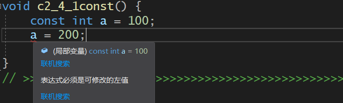

- **因为const对象一经初始化后就不能改变，所以必须初始化**
- 4.1 **初始化与const**
- 4.2 **const type &a**
- 4.3 **const type *a**
- 4.4 **type * const a**
- 4.5 **顶层const和底层const**
- 4.6 **constexpr和常量表达式**

------


### 4.1 初始化与const

- const 限定的变量类型，可以由**任意复杂的表达式初始化**。如变量a或者一个函数的返回值
- 只要不改变**const修饰的对象**，什么操作都行；比如用该对象初始化其他非const修饰变量

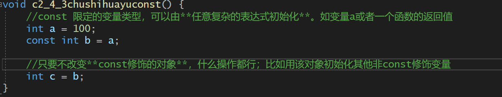

------


### 4.2 const修饰  引用“指向”对象（&a）（修饰的是“引用连接对象的这个路线”     所以不能通过引用（a）来改动原先变量）

> 因为引用不是对象，所以没有const直接修饰引用变量

- **指向const的引用**：
  - 又称**常量引用**，因为引用变成了一个**常量**，const修饰的是**引用这个复合类型**
  - 作用：**将引用变成一个不可修改的值**，即不能通过**引用改变一个变量的值**，但是 **该变量的值** 还是可以通过 **之前的变量名** 改变，**该变量本身不是一个常量**

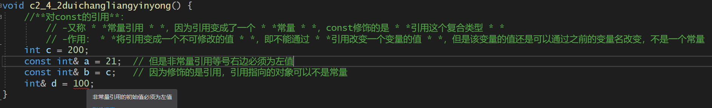

- **对常量引用的初始化**：

  - **必须初始化**
  - **数据类型必须匹配** 

  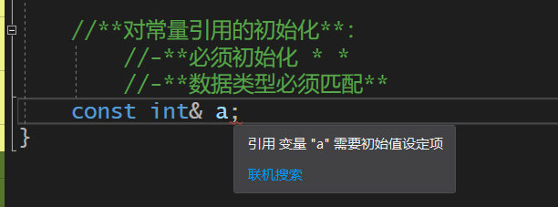

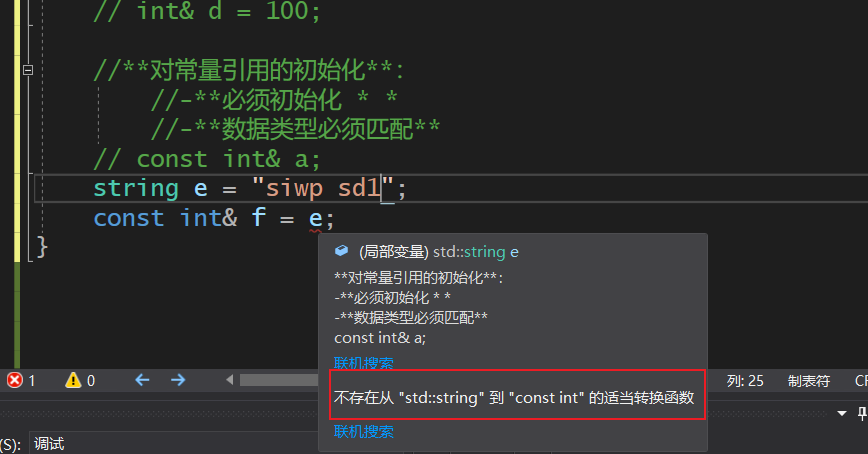

------


### 4.3 const修饰  指针"指向“对象（*a）（修饰的是”指针指向对象的这个路线“  所以不能通过`*a`来改变指向的对象的值 ）

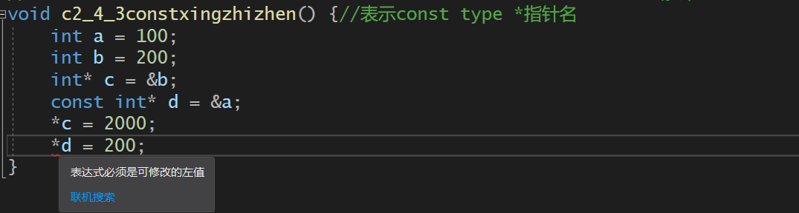

------


### 4.4 const修饰  指针对象（a）（修饰的是”指针指向对象存储的地址值“  所以不能改变指针指向的对象 ）

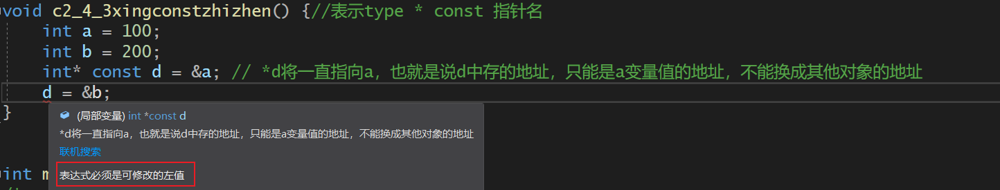

------


### 4.5 顶层const和底层const

- **顶层const**：
  - 表示修饰的对象本身。指针本身不是*p，而是p。
- **底层const**：
  - 表示对指针和引用等复合类型时，修饰其指向的对象

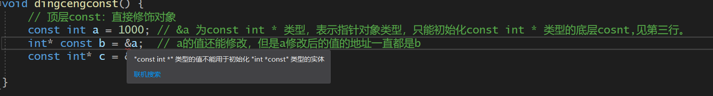

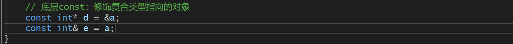

------


### 4.6 constexpr和常量表达式

- **常量表达式：**指 **值不会改变**，并且在**编译过程中就能够得到计算结果**的表达式
- **一个对象或者表达式是不是常量表达式由以下两个因素共同决定**：
  - 对象的数据类型，是不是const修饰的常量
  - 对象的初始值，是不是字面值常量，像 42 ，‘a'这样的

相当于宏定义，在编译阶段完成计算。

------


## 5. 处理类型

> 随着程序越来越复杂，程序中用到的类型也越来越复杂，这种复杂性体现在两个方面。
>
> ​		1.一些类型难于“拼写”，它们的名字既难记又容易写错，还无法明确体现其真实目的和含义。
>
> ​		2.二是有时候根本搞不清到底需要的类型是什么。

- 5.1 **类型别名**：解决上述第一个问题
- 5.2 **auto类型说明**：解决上述的第二个问题
- 5.3 **decltype类型指示符**：解决上述的第二个问题


### 5.1 类型别名

> **类型别名** 是一个名字，是某种类型的同义词

- 传统定义 **类型** 别名方法：使用 **typedef** 关键字 ；typedef  原类型名  别名
- 新标准规定方法：使用别名声明来定义；using  别名 = 原类型名

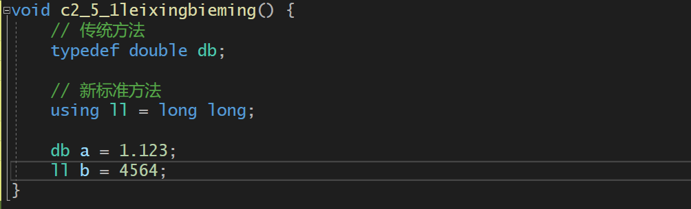

#### 当别名指代复合类型或常量

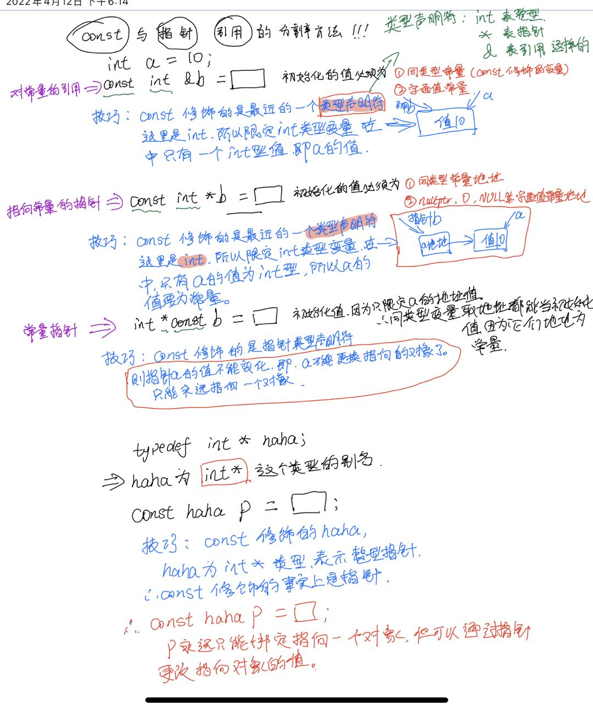

------


### 5.2 auto类型说明符

> ​        编程时常常需要把表达式的值赋给变量，这就要求在声明变量的时候清楚地知道表达式的类型。然而要做到这一点并非那么容易，有时甚至根本做不到。为了解决这个问题，C++11新标准引入了auto类型说明符，用它就能让编译器替我们去分析表达式所属的类型。

- auto 类型说明符 通过 **变量的初始值** 来推断出该变量的类型。

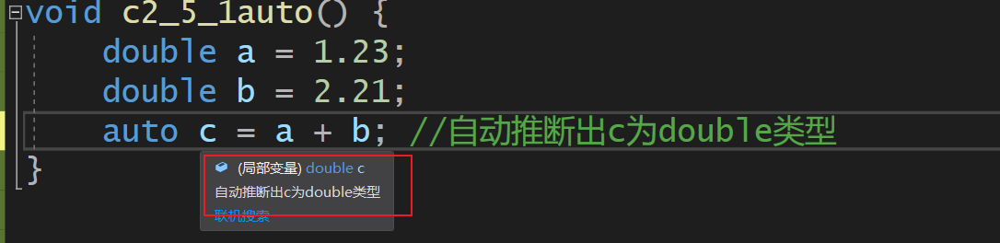


#### const、复合类型和auto

（1）当auto后跟着的是引用类型，则其类型为引用的对象的类型

```C++
int i = 0，&r = i;
auto a = r;		// a的类型为整型，而非引用
```

（2）auto一般会忽略掉顶层const，同时底层const则会保留

```C++
const int ci = i,&cr = ci;
auto b = ci;	// 忽略掉顶层const，b是一个整型变量
auto c = cr;  	// auto 为引用的对象的类型，即整型，c为整型变量
auto d = &i;	// 初始值是一个地址，所以d是一个指针变量
auto e = &ci;	// &ci是一个整型常量的地址，所以e为指向整型常量的指针
```

（3）如果希望auto推断出来的类型是一个顶层const，则需要在前面明确指出

```c++
const auto f = ci;
```

（4）还可以将引用的类型设为auto

```c++
auto &g = ci;	// ci是整型常量，所以g是一个整型常量引用
auto &h = 42;	// 错误，非常量引用的初识值必须是左值
const auto &j = 42;	// 正确，常量引用的初识值可以是字面值
```

------


### 5.3 decltype类型指示符

> 希望从一个表达式中推断出变量类型，但是不想用该表达式的值初始化变量。

- **decltype** 类型指示符，选择并返回操作数的数据类型。

```c++
decltype(f()) sum = x;	// sum的类型就是函数f的返回类型
```

------


## 6. 自定义数据结构

> C++语言允许用户以类的形式自定义数据类型。


### 6.1 定义Sales_data类型

- 类以关键字 **struct** 开始，后面接着  **类名** 和 **类体**
- **类体**：由花括号包围形成一个新的作用域
- 类的内部定义的名字必须唯一，但是可以和类外部的名字重复
- 类体右侧表示结束的花括号必须写一个分号

```c++
struct Sales_data{
	std::string bookNo;
	unsigned units_sold = 0;
    double revenue = 0.0;
};
```

- 类体后面可以紧跟变量名以示对该类型对象的定义

```c++
struct Sales_data{
	std::string bookNo;
	unsigned units_sold = 0;
    double revenue = 0.0;
}accum,trans;
```

------


### 6.2 使用Sales_data类

```c++
// 创建两个Sales_data对象
Sales_data data1,data2;
// 自定义类的类型（即类名）  变量1，变量2;	都使用默认初始化  
```

- 通过对象，访问其中的数据成员（即类的属性）

```c++
data1.bookNo = "hello world";
data1.units_sold = 20;
data1.revenue = 423.5
```

------


### 6.3 头文件中编写类

> ​       尽管可以在函数体中定义类，但是这样会受到一些限制。所以类通常被定义在头文件中。

- 类所在头文件的名字应该与类的名字一样
- 头文件通常包含那些只能被定义一次的实体

#### 预处理器概述

> 确保头文件多次包含任然能安全工作的常用技术是预处理器

- #define 指令将一个名字设定成预处理变量
- #ifdef 仅当变量已定义时为真
- #ifndef 仅当变量未定义时为真
- #endif 如果变量没定义，则执行后续操作知道遇到该指令为止

```c++
// 示例
#ifndef	SALES_DATA_H	//如果该类没有定义则继续，定义了则直接终止
#define SALES_DATA_H	// 把头文件名字设定为预处理变量
#include <string>
struct Sales_data{
	std::string bookNo;
	unsigned units_sold = 0;
    double revenue = 0.0;
}accum,trans;
#endif					// 结束预处理器
```

​		第一次包含Sales data.h时，#ifndef的检查结果为真，预处理器将顺序执行后面的操作直至遇到#endif为止。此时，预处理变量SALESDATAH的值将变为已定义，而且sales data.h也会被拷贝到我们的程序中来。后面如果再一次包含Sales_data.h，则#ifndef的检查结果将为假，编译器将忽略#ifndef到#endif之间的部分。
