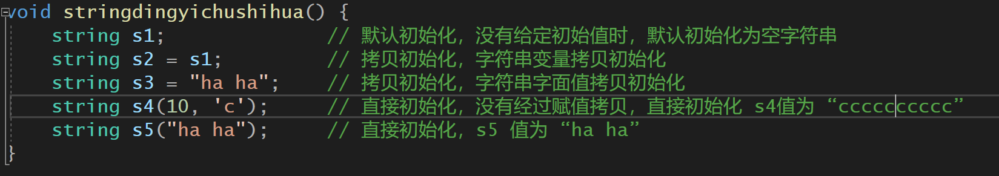
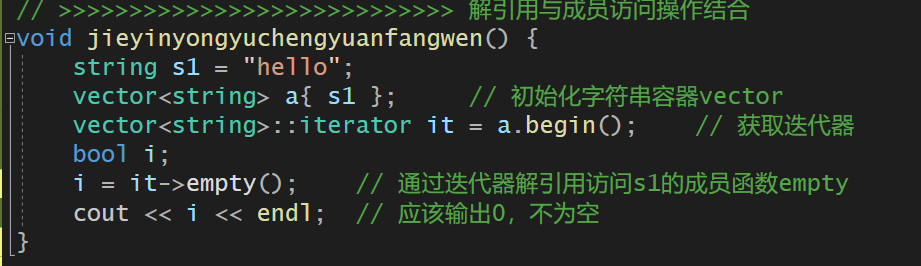
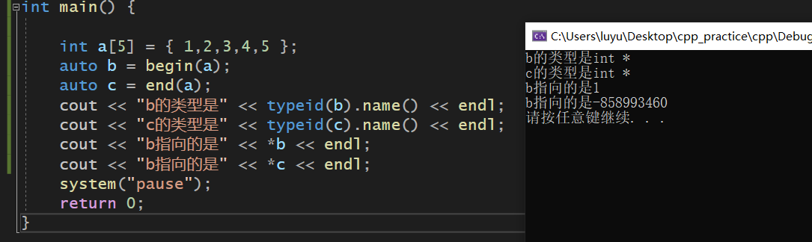

# 第三章	字符串、向量、数组

[TOC]

> ​		本章主要介绍两种标准库类型和一个内置类型
>
> ​		标准库类型：  string 字符串类型	**可变长字符序列**
>
> ​         					    vector 向量类型	**给定类型对象可变长序列容器**
>
> ​		 内置类型;		array 数组		**不可变长**


## 1.命名空间using声明

> ​		目前，我们使用的库函数都属于命名空间 **std** ，可以使用域操作符（::）从域操作符左侧名字中所示作用域寻找右侧的那个函数名字。例如 std::cin ,就是从std命名空间寻找cin函数

- 有了 **using** 声明，即无须每次都使用域操作符，就可以直接使用函数名字了。

------


## 2. 标准库类型 string

> 标准库类型 **string** 表示 **可变长的字符序列**，使用 string 类型必须首先包含string头文件


### 2.1 定义和初始化 string 对象

> 如何初始化类的对象，是由类的本身决定的

- 字符串初始化的几个常用方式：

- **直接初始化** ：使用 ’= ‘ 初始化一个变量，实际上执行的就是拷贝初始化
- **拷贝初始化** ：不使用 “= ” ，则执行的是直接初始化



------


### 2.2 string 对象上的操作

> 一个类除了要规定初始化其对象的方式外，还有定义对象上的操作。
>
> ​		定义通过函数名调用的操作
>
> ​		定义<<、+等各种运算符在该类对象上的新含义

#### （1）读写 string 对象	<只能读取没有空格的字符串>

> 第一章介绍过，使用标准库中的 **iostream** 来读写 int 、double 等内置类型的值。同样也能读写string对象。

- **cin >>  s** 与 **cout << s**：会忽略开头的空白（空格符、换行符、制表符等），从第一个字符开始读取，知道遇到下一个空白，
- 中间有空白的，可以分成多个输入或者多个输出写在一起


```C++
string s1;
string s2;
cin >> s1 >> s2;
cout << s1 << s2 << endl;
```

**中间遇到空格后，接下来的输出会给第二个字符串对象**

#### （2）读取未知数量的 string 对象

- 使用 while 循环 一直反复读取 string 对象

```c++
int main(){
    string word;
    while(cin >> word)
        cout << word << endl;
    return 0;
}
```

> 循环的读取一个string对象然后输出，然后继续读取下一个对象，周而复始。

#### （3）使用 getline 读取一整行 <可以读取有空格的字符串> 

> 如果希望最终得到的字符串中保留输入时的空白符，可以使用 **getline** 函数代替原来的 **>>**。

- getline()函数，参数是一个输入流 和 **string** 对象；例如 getline(cin,string对象)。但是遇到换行符会结束输入

```C++
int main(){
    string line;
    // 每次读入一整行，直至到达文件末尾
    while(getline(cin,line))
        cout << line << endl;
    return 0;
}
```

#### （4）判断 string 对象为空empty函数，和计算字符串大小 size函数

- string 字符串类中的 **string** 方法：
  - 用来判断字符串是否为空字符串
- string 字符串类中的 **size** 方法：
  - 用来计算字符串的大小


#### （5）size_t 类型

- 该类型是字符串大小 **size函数** 所返回的类型，表示为字符串的大小

#### （6）比较 string 对象

> **string** 类定义了几种用于比较字符串的运算符。

- **相等性运算符**（== 和 ！=）：检验两个 string 对象相等或者不相等
- **关系运算符**（<、<=、>、>=）：检验一个 string 对象是否小于、小于等于、大于、大于等于另一个string对象。

- **大小判断标准：**
  - 如果两个string对象的长度不同，而且较短string对象的每个字符都与较长string对象对应位置上的字符相同，就说较短string对象小于较长string对象。
  - 如果两个string对象在某些对应的位置上不一致，则string对象比较的结果其实是string对象中第一对相异字符比较的结果。


#### （7）为 string 对象赋值

- 可以使用其他的 string 对象给另一个 string 对象赋值

#### （8）多个 string 对象相加 = 多个string对象拼接


#### （9）字面值和 string 对象相加 

> 标准库允许把 **字符字面值和字符串字面值** 转换成 string对象

- **字符和字符串字面值** 不能直接相加
- 所以说加号两边必须要有一个string对象，才能执行类型的转换。

------


### 2.3 对 string 对象上的字符操作

> 我们经常需要单独处理 string 对象中的字符。
>
> ​	比如：1.检查一个string对象是否包含空白
>
> ​				2.把string对象中的字母改成小写
>
> ​				3.查看某个特定的字符是否出现等
>
> 可以通过 cctype 头文件中的函数来处理


> **cctype** 头文件和 **ctype.h** 头文件 是一个头文件，但是cctype属于std命名空间，后者则不是

#### （1）使用 for（区别于循环for，这个for与python中的for很像，是range for）

- **语法形式为**：for （类型定义：序列对象）


- 然后可以结合 cctype 的库函数对每个元素进行操作

#### （2）使用下标（又称索引）进行 string 对象中的元素操作

-  **下标运算符为**: `[]`
- 下标运算符接收的参数是 `string::size_t`类型的值
- s[0]表示第一个元素 ， s[s.size() - 1]是最后一个元素


------


## 3. 标准库类型 vector

> ​		**标准库类型vector**：表示对象的集合，其中的所有对象的类型都相同。集合中的每个对象都有一个与之对应的索引，用于访问对象。因此 vector 也叫做”容器“

> ​		C++语言既有 **类模板**，也有 **函数模板**，其中 vector就是一个类模板，相当于一个模具
>
> ​		编译器根据模板创建类对象或者函数的过程称为 **实例化**

- **需要包含头文件 `<vector>`**
-  **`vector <type> 标识符` 这就是一个vector实例化语句** 
- **vector 是模板，而不是类型，<>包着的才是数据类型**


> ​		vector 能容纳绝大多数的对象作为其元素，但是引用不是对象，所以存在包含引用的vector
>
> ​		其他内置类型和类的类型都能构成vector对象，vetcor自身也能构成vector对象


### 3.1 定义和初始化 vector 对象

> 和任何一种类的类型一样，vector模板控制着定义和初始化向量的方法。下表列出了常用方法


- **默认初始化**：不给定初始值，将会默认初始化为一个空的vector
- **拷贝初始化**：使用 = 来进行拷贝初始化
- **直接初始化**：使用（）进行初始化


> 拷贝和直接初始化跟string类型一样。下面主要介绍列表初始化


#### （1）列表初始化 vector 对象

> C++11新标准还提供了另外一种为vector对象的元素赋初值的方法，即**列表初始化**
>
> ​		**列表初始化**：用 **花括号** 括起来的0个或多个初始元素值被赋给 vector对象
>
> ​		必须是大括号（花括号），可以用 <type> 内的类型进行初始化了


#### （2）创建指定数量的元素

- 使用直接初始化的时候，如果小括号不是 `vector<type>` 类型，而是一个 int类型的值，则这个值指定**vector** 容器中 **type** 类型 的数量。并且根据小括号内第二个参数进行初始化
- 如果小括号第二个参数没有，则执行默认初始化
- 如果有参数，则将 vector 中每个元素替换成该参数值


------


### 3.2 向 vector 对象中添加元素

- **vector** 的成员函数 **push_back** 负责把一个值当成 vector 对象的尾元素压入 vector 对象的尾端


------


### 3.3 其他 vector 操作


> 大多数操作与 string对象类似

#### （1）访问 vector 对象中的元素的方法

> 与 **string对象** 访问元素方法一样。有两个

- for （类型  标识符：vector对象）
- [] 下标法访问


#### （2）不能使用下标的形式添加元素


------


## 4. 迭代器介绍

> ​		我们已经知道可以使用 **下标运算符** 和 **for（range for）**来访问 **string** 对象的字符或 **vector** 对象的元素
>
> ​		还有一种更通用的机制可以实现同样的目的。这就是迭代器

- 除了vector之外，标准库还定义了其他几种容器。所有标准库容器都可以使用迭代器，但是其中只有少数几种才同时支持下标运算符。
- **迭代器** 类似于 **指针**，能够间接的访问对象，迭代器指向的对象是 **容器或者string中的字符**。
- **迭代器** 能从 **一个元素移动到另一个元素**
- **迭代器** 有 有效和无效之分，有效的迭代器指向某个元素，或者指向容器中尾元素的下一个位置。其他所有情况均为无效


### 4.1 使用迭代器

> 与指针不同，获取迭代器不是用取地址符。 拥有迭代器的类型（容器vector，string等），同时也拥有 **返回迭代器的成员函数**

- **begin** 成员函数：负责返回指向 **第一个元素** 的迭代器
- **end** 成员函数：返回指向容器  **尾元素的下一个位置** 的迭代器

> 如果容器为空，则 **begin** 和 **end** 返回的是同一个迭代器


表示返回的是 **容器vector对象中** 的 **迭代器** （迭代器也是一种类型）


#### （1）迭代器运算符


- 使用 **解引用符 ** * 来获取 迭代器所指向的元素，返回的是一个引用类型，即可以通过*it来修改元素值


#### （2）将迭代器从一个元素移动到另一个元素

> 迭代器使用 递增（++）运算符，来从一个元素移动到下一个元素


#### （3）迭代器类型

> 就像不知道string 和 vector 的 size_t 类型一样，迭代器类型我们也不知道精确的类型

- 拥有迭代器的标准库 使用 **iterator** 和 **const_iterator** 来表示迭代器的类型
  - **iterator：** 表示 **能通过迭代器** 改写 迭代器指向的元素
  - **const_iterator**：表示 **不能通过迭代器** 改写迭代器指向的元素 


#### （4）begin和end运算符

- 这两个的返回具体类型由对象是否是常量决定
  - 是常量，返回const_iterator
  - 不是常量，返回 iterator

> 如果对象只需读操作而无须写操作的话最好使用常量类型（比如const_iterator）。为了专门得到const_iterator类型的返回值，c++引入了两个新函数，分别为 cbegin 和 cend


#### （5）结合解引用和成员访问操作

> ​		解引用迭代器可获得迭代器所指的对象，如果该对象的类型恰好是类，就有可能希望进一步访问它的成员。

- 可以通过 *（迭代器）来获取迭代器所指对象的引用，然后通过 `.` 来访问该对象的成员函数，为了让解释器把 *和迭代器看成一个整体表示对象的引用，使用小括号括起来


> 为了简化上述表达式，定义了箭头运算符`->`，把解引用和成员访问两个操作结合在一起。



------


### 4.2 迭代器运算

> ​		迭代器的递增运算令迭代器每次移动一个元素，所有的标准库容器都有支持递增运算的迭代器。类似的，也能用==和！=对任意标准库类型的两个有效迭代器进行比较
>
> ​		string和vector的迭代器提供了更多额外的运算符，一方面可使得迭代器的每次移动跨过多个元素，另外也支持迭代器进行关系运算。所有这些运算被称作**迭代器运算**


#### （1）迭代器的算术运算

- 可以令迭代器和一个整数值相加（或相减），其 **返回值** 是向前（或向后）移动了若干个位置的 **迭代器**。这样可能出现两种情况
  - 移动超过容器范围，迭代器指向尾元素的下一个位置
  - 移动没超过容器范围，迭代器指向容器内的一个元素


#### （2）difference_type 类型

- 该类型表示为 两个迭代器的距离大小


#### （3）使用迭代器运算

使用迭代器完成二分查找。略

------


## 5. 数组

> 数组是一种类似于标准库类型 vector 的数据结构，但是性能和灵活性上的权衡与 vector 不同。
>
> 数组也是存放相同的对象的容器，这些对象没有名字，需要通过其所在的位置访问
>
> 相对于 vector 容器，灵活性不足，但是性能更好


### 5.1 定义和初始化数组

> **数组** 是一种复合类型，数组中元素的个数属于数组类型的一部分，编译的时候维度应该是固定的，已知的，即维度必须是一个常量表达式

```C++
void hhh() {
	unsigned a = 32;			// 相当于 unsigned int a = 32; 不是常量
	constexpr unsigned b = 42;	// b 是常量
	int arr[10];				// 含有十个整数的数组
	int* parr[b];				// 含有42个整型指针的数组
    int(*c)[10];				// 指向一个含有10个整型变量数组的指针
	string bad[a];				// a不是常量，数组需要给定大小
}	
```


#### （1）显式初始化数组元素

> 使用列表初始化，显式的初始化数组元素

- 此时，可以忽略数组的维度，因为编译器可以从花括号的元素个数推断出来
- 如果给定了维度，花括号内的元素不能超过，可以小于维度。剩下的元素执型默认初始化


#### （2）字符数组的特殊性

- 我们可以用 **字符串字面值** 来初始化 **字符数组**
  - 但是字符串字面值的结尾处还有一个空字符，这个空字符也会像其他字符一样被拷贝到字符数组中


#### （3）不允许数组之间的拷贝和赋值

-  **不能将数组的内容** 拷贝给 **其他数组** 作为其初始值
- 不能用 **数组** 给 **其他数组赋值**


#### （4）理解复杂的数组声明

> 数组可以存放大多数类型的对象。例如定义一个存放指针的数组。又因为数组也是对象，也可以定义数组的指针和引用。这样就比较复杂了，需要仔细分析理解

- **存放指针的数组** 声明：

```c++
int *arr[10];		// arr是一个含有10个整型指针的数组
```

- **因为引用不是对象**，**所以不存在存放引用的数组**

```c++
int &arr[10];		//错误，引用不是个对象，所以没有引用的数组
```

- **指向数组的指针** 声明：

```C++
int （*arr）[10] = &a;	// arr这个指针指向一个容量为10的数组，数组名为a
```

- **指向数组的引用** 声明：

```C++
int （&arr）[10] = a;		// arr这个引用是a数组的别名
```

------


### 5.2 访问数组元素

> ​		与标准库类型 vector和string一样，数组的元素也能使用范围for语句或下标运算符来访问。数组的索引从0开始

- 数组的下标类型是 size_t，在使用数组下标的时候，通常将其定义为sizet类型。sizet是一种机器相关的无符号类型，它被设计得足够大以便能表示内存中任意对象的大小。在cstddef头文件中定义了size_t类型，这个文件是C标准库stddef.h头文件的C++语言版本。

- 操作跟vector容器非常类似，使用 for 迭代

------


### 5.3 指针和数组

- **对数组使用下标运算符可以取到指定位置元素**
- 


- **对数组的元素使用取地址符可以得到指向该元素的指针**

- 


- **在很多用到数组名字的地方，编译器会自动的将其转换成一个指向  *数组首元素*  的指针**

- 


- 当**数组作为一个变量的初始值**时，使用**auto**推断出的类型**是指针而非数组**

- 


- **使用decltype关键字时**，转换成指针的行为不会出现，**类型会显示为数组**
- 

#### （1）指针也是迭代器

- vector 和 string 的**迭代器支持的运算**，**数组的指针全部都支持**

- 


- 我们**可以取到数组的尾后指针**，即数组最后一个元素之后不存在的元素的地址，但是**不能用来解引用和递增操作**

- 


#### （2）标准库函数begin和end

> ​		尽管能够计算得到尾后指针，但是这种用法很容易出错，所以，c++11标准引入了两个名为begin和end的函数。
>
> ​		这两个函数与容器中的两个同名成员功能类似，因为这两个不是成员函数，而是函数，所以需要数组作为其参数。

- **begin函数，end函数获取首指针和尾后指针**
- 


#### （3）指针运算

> ​		指向数组元素的指针可以执行表中列出的所有迭代器运算，这些运算包括：解引用、递增、比较、与整数相加等，用在指针和用在迭代器上意义完全一样

- **当给数组名加上一个数字或者一个整型变量时，自动转换成指向首元素的指针，并支持迭代运算**

- 


- **两个指针相减的结果类型是一种名为 `ptrdiff_t` 的标准库类型**（？为啥实际是int）


#### （4）解引用和指针运算的交互

-  指针加上一个整数所得的结果还是一个指针。如果这时指针还指向一个元素，则允许解引用该结果指针

- 


#### （5）下标和指针

- **对数组使用下标运算符时，编译器会自动执行（4）中的操作**

- 


- **只要指针指向的还是数组中的元素，都可以执行下标运算**

------


### 5.4 C风格字符串

> ​		字符串字面值是一种通用结构的实例，这种结构即是C++由C继承而来的C风格字符串，**C风格字符串不是一种类型，而是为了表达和使用字符串而形成的一种约定俗称的写法。**按此习惯书写的字符串存放在字符数组中 并以空字符结束（null terminated）。以空字符结束的意思是在字符串后面最后一个字符后面跟着一个空字符（’\0‘）。一般利用指针来操作这些字符串

- C语言字符串定义：一般都是使用字符数组来存储字符串


#### （1）C标准库string 函数

- C语言标准库提供了一系列函数操作字符串，定义在 string.h 中，cstring是C该头文件的C++版，传入此类函数的指针（一般使用指针操作C风格字符串）必须指向以空字符作为结束的数组


#### （2）比较字符串

- **c++标准库string字符串比较**

- 


- **C语言风格string字符串比较**

- 


#### （3）目标字符串的大小由调用者指定

- C++中字符串可以直接连接，但是C语言不行，因为两个指针相加没有意义，而且非法。正确的方法是使用strcat和strcpy函数

- 


- 一个大问题：

- 

------


### 5.5 与旧代码接口

> ​		C++需要与之前的C风格字符串代码衔接，C++专门提供了一组功能

#### （1）混用string对象和C风格字符串

- **使用C语言字符串初始化c++string标准库类型**：c++中标准库string对象允许使用字符串字面值来初始化string对象，为了兼容C风格字符串，**c++中任何出现字符串字面值的地方都可以用空字符串结束的字符数组来替代。**
  - 

- 

- 


- **使用C++标准库类型初始化C语言字符串**：这时我们不能直接使用string对象来代替它，毕竟string对象无法初始化指针。
  - C++string标准库类型专门提供了`c_str` 的成员函数，用来返回一个C风格字符串

- 


（2）**使用数组初始化vector对象**

- C++**不允许** 使用 **一个数组初始化另一个数组**，也不允许 使用 vector对象初始化数组。但是允许使用**数组来初始化vector**

------


## 6. 多维数组

> ​		严格来说，c++语言中没有多维数组，通常说的多维数组其实是数组的数组。
>


### 6.1 定义多维数组

- 当一个数组的元素仍然是数组时，通常使用两个维度来定义它，**第一个维度表示数组本身大小**，**另一个维度表示其元素大小**


------


### 6.2 多维数组初始化

> ​		允许使用花括号括起来的一组值初始化多维数组
>

- **方法1 ：**
- 

- **方法2：**与方法1本质上是一样的


- **方法3**：初始化每一行的第一个元素，后面的元素执行默认初始化


------


### 6.3 多维数组的下标引用

- 如果表达式含有的**下标运算符的数量** 与**数组的维度**一样多，表达式的结果将是给定类型的元素


------


### 6.4 使用范围for语句处理多维数组


- 如果不使用引用&b去接收a中的数组形式元素，编译器会自动将这些数组形式元素转换成该数组内首元素的指针，则b的类型就会变成 int*，那么内层循环就不合法了

- 

------


### 6.5 指针和多维数组

> ​		当程序使用多维数组的名字时，也会自动将其转换成指向数组首元素的指针，所以多维数组名转换成的指针实际上是指向第一个内层数组的指针

- 使用auto和decltype可以尽可能避免在数组前面加上一个指针类型

------


### 6.6 类型别名简化多维数组的指针


