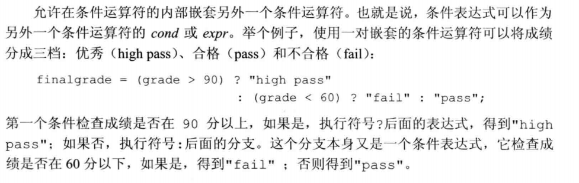

# 第四章 表达式

[TOC]

什么叫表达式？

- 表达式由一个或多个运算对象（operand）以及运算符组成
- 对表达式求值将得到一个结果（result）
- 字面值和变量是最简单的表达式（expression），其结果就是字面值和变量的值。
- 把一个运算符（operator）和一个或多个运算对象组合起来可以生成较复杂的表达式。

## 1. 基础

### 1.1 基本概念

- **一元运算符：** 作用于一个运算对象的运算符是一元运算符，如 取地址符(&)、解引用符(*)
- **二元运算符：** 作用于两个运算对象的运算符是二元运算符，如 相等运算符(==)、乘法运算符(*)等
- 还有作用于三个对象的 **三元运算符**
- **函数调用** 也是一种特殊的运算符，它对运算对象的数量没有限制

> ​		有些符号既能作为一元运算符，也能作为二元运算符，但是使用时的含义发生了很大变化，比如符号 *。作为一元运算符，他是解引用操作；作为二元运算符时，他是执行乘法操作。


#### （1）组合运算符和运算对象

> ​		对于多个运算符的复杂表达式来说，要理解其含义，必须理解 **运算符优先级**、**结合律**、以及 **运算对象的求值顺序**


#### （2）运算对象转换

> ​		在表达式求值过程中，运算对象常常由一种类型转换成另外一种类型。但是有些运算对象的类型不同也没有关系，只要他们能被转换。第四章会详细介绍


#### （3）重载运算符

> ​		c++语言定义了 **运算符** 作用于 **内置类型** 和 **复合类型的运算对象** 时所执行的操作。
>
> ​		当运算符作用于 **类类型的运算对象** 时，用户可以自行定义其含义。因为这种自定义的过程事实上是为已存在的运算符赋予了另外一层含义，所以称之为 **重载运算符**
>
> ​		例如：IO库的 >> 和 << 运算符 等都是重载运算符


#### （4）左值和右值

> - C语言中，**左值** 可以位于赋值语句的左侧， **右值** 则不能
> - 但是C++中，二者的区别就变大了。
>   - 左值表达式 的求值结果是 **一个对象** 或者 **一个函数** ，但是以 **常量对象** 为代表的某些左值实际上 **不能作为复制运算的左侧对象**
>   - 另外一些表达式的求值结果是对象，但是他们是 **右值** 而不是 **左值**
>
> - C++中左值右值简单的归纳：
>   - 当 **一个对象被用作右值** 的时候，用的是 **对象的值** 
>   - 当 **一个对象被当做左值** 的时候，用的是 **对象的身份**（在内存中的位置）

- **左值** 可以被当做右值使用，这个时候使用的是 **左值的内容（即左值的值）**
- 但是 **右值** 不能被当做 **左值** 使用

几个比较熟悉的 **运算符** 用到 **左值** 的：

1.  **赋值运算符** 需要一个 **左值** 作为其 **左侧的运算对象**，得到的结果也仍然是一个左值
2. **取地址符** 作用于一个 **左值运算对象** ，返回一个指向该运算对象的指针，这个指针是一个右值                          （&a）返回的是右值
3. **内置解引用运算符**、**下标运算符** 、**迭代器解引用运算符**、**string和vector的下标运算符** 的求值结果 都是 **左值**        （*a）返回的是左值
4. **内置类型** 和 **迭代器** 的 **递增递减运算符** 作用域左值运算对象，其前置版本（++a）所得的结果也是左值

> ​		使用关键字decltype 的时候，左值和右值也有所不同
>
> ​		如果表达式的求值结果是 **左值** ，decltype作用于该表达式得到一个引用类型，例如：p的类型是int *,因为其是返回的左值，所以decltype(p)的结果是 int &. 如果取地址符生成右值 ， 则decltype（&p）的结果是 int**

------


### 1.2 优先级与结合律

> ​		**复合表达式** 是指含有两个或多个运算符的表达式，
>
> ​		**优先级和结合律** 决定了运算对象组合的方式

- **高优先级的运算符** 要比 **低优先级的运算对象** 更为紧密的组合在一起
- **如果优先级相同**，其组合规律由 **结合律** 确定


#### （1）括号无视优先级与结合律

> ​			括号无视普通的组合规则，表达式中 **括号括起来的部分** 被当成一个单元来求值，然后再与其他部分一起按照优先级组合。


#### （2）优先级与结合律有何影响

```C++
int a[] = {1,2,3,4,5};
int last = *(a+4);	// 首先算括号里面的，a其实是数组的头元素指针，所以a+4表示往后移动四位，这时是指向a[4]这个对象的指针
int last1 = *a +4;	//表示a[0]的值加上4再去初始化   
```

------


### 1.3 求值顺序

> ​		优先级规定了运算对象的组合方式，但是没有说明对象按照什么顺序来求值，在大多数情况下，不会明确求值的顺序。

例如：如下表达式：

```c++
int i = f1()*f2();
```

​		虽然知道 f 1 和 f 2 一定会在执行乘法之前调用，但是无法知道 f 1在f 2之前还是 f 2在f 1之前调用

- 有四种运算符明确规定了运算对象的求值顺序
  - 逻辑与 `&&` 运算符：它规定先求左侧运算对象的值，只有左侧运算对象的值为真时，才继续求右侧运算对象的值
  - 逻辑或 `||` 运算符：
  - 条件 `？：` 运算符：
  - 逗号运算符`，`

#### （1）求值顺序、优先级、结合律详细示例

**表达式**：

```c++
f() + g()*h() + j()
```

- 优先级规定，g() 返回值和 h() 返回值相乘
- 结合律规定，f() 返回值先与g() 和 f() 乘积相加，所得的结果再与 j() 的返回值相加
- 对于这些函数的调用顺序没有明确规定

------


## 2. 算术运算符


- **优先级** ： 一元运算符  >  乘法除法  >  加减法
- **算术运算符** 能够作用于 **任意算术类型（整型，字符，布尔型，浮点型）**，以及任意能 **转换成** **算术类型的类型**
- **算术运算符的运算对象和求值结果** 都是 **右值**
- **一元正号运算符、加法、减法运算符**都能作用于指针。
  - 当一元正号运算符作用于一个指针或者算术值时，返回运算对象值的一个提升后的副本

```c++
int i = 1024;
int k = -i;		// -i为右值，值为-1024
bool b = true;
bool b2 = -b; 	// bool型 -1也是true
```

#### 溢出与其他算术运算异常

- **溢出**：


## 3. 逻辑与关系运算符


- **关系运算符**：作用于算术类型或者指针类型
- **逻辑运算符**：作用于任意能转换成布尔值的类型
- 这两类运算符，**运算对象** 和 **求值结果** 都是右值

#### （1）逻辑与和逻辑非运算符

- 这两个运算符 都是先求 **左侧运算对象的值** 再求 **右侧运算对象的值**
- 当 **左侧运算对象无法确定表达式的结果** 时才会计算 **右侧运算对象的值** ，这种策略叫 **短路求值**
  - 对于逻辑与运算符来说，当且仅当 左侧运算对象为 **真** 时 才对右侧运算对象求值
  - 对于逻辑或运算符来说，当且仅当 左侧运算对象为 **假** 时 才对右侧运算对象求值


#### （2）逻辑非运算符

- 逻辑非运算符将 **运算对象的值取反** 后返回


#### （3）关系运算符

- 关系运算符比较运算对象的大小关系，并返回布尔值


#### （4）相等性测试与布尔字面值

- 如果想要测试一个 **算术对象或者指针对象的真值** ，最直接的办法就是将其作为if语句的条件
  - 真值为 0 ，则条件为假
  - 真值非 0 ，则条件为真

------


## 4. 赋值运算符

- **赋值运算符的左侧对象** 必须是一个可修改的左值
- 赋值运算的结果是 **它的左侧运算对象** ，并且该对象是个 **左值**
- **类型转换**：赋值运算符 左右两个对象类型不同时，**右侧运算对象**将 **转换成** **左侧运算对象的类型**
- C++11**允许花括号初始化列表** 作为赋值语句 **右侧运算对象**
  - 但是与内置类型，花括号内最多只能包含一个值
  - 对于类对象，细节由类本身决定，对于vector ，vector模板 **重载了赋值运算符** 并且 **可以接收初始值列表**
  - **重点**：无论左侧运算符类型是什么，初始化列表都可以为空。编译器会创建一个临时量赋给左侧运算对象

#### （1）赋值运算符满足右结合律

> ​		与其他的二元运算符不同，赋值运算符满足右结合律
>
> ​		会先计算右边的运算对象，然后再赋值给左边运算对象


#### （2）赋值运算符优先级较低

> ​		因为赋值运算符的优先级低于关系运算符的优先级，所以条件语句中赋值部分通常应该加上括号


#### （3）不要混淆相等运算符和赋值运算符

> 赋值运算符为： = 
>
> 相等运算符为： == 


#### （4）复合运算符

> ​		我们经常需要对对象施以某种运算，然后将计算结果再赋给对象
>
> ​		所以使用 **复合赋值运算符** 来代替多步操作


------


## 5. 递增和递减运算符

> ​		递增运算符（++）和递减运算符（--）为对象的加1和减1操作提供了一种简洁的书写形式，并且可以应用于迭代器，迭代器本身不支持算术运算，但是支持递增和递减运算

- **前置版本（++a）**：先将运算对象加1，然后将改变后的对象作为求值的结果，其实还是本身
- **后置版本（a++）**：也会将运算对象加1，但是求值后的结果是**之前**的对象的副本


- 这两个运算符必须作用于 **左值**，前置版本将对象本身作为左值返回（即作用于左值，返回左值） ，后置版本将返回 **对象原始值** 的 **副本** ，是一个右值（即作用于左值，返回右值）

> 建议：除非必须，否则不用递增递减运算符的后置版本


------


### 5.1 混用解引用符和递增运算符

> ​		如果我们想在一条复合表达式中既 **将变量加1或减1**，**又能使用它原来的值**，这时可以使用递增递减运算符的后置版本

例子：

```c++
vector<int> a{1,2,3,4,5,6,-4,5,6};
auto itr = a.begin();
while (itr != a.end() && *itr >=0 )
    cout << *itr++ << endl;
```

- 因为 **递增运算符的优先级** 高于 **解引用符**，所以最后的 *itr++，等价于 *（itr++），然后**itr++后置递增**返回的是 **未递增之前的对象的副本**，所以这句话的意思是 **将现在迭代器位置的对象的值输出**， 然后 **移动到下一个位置**

------


### 5.2 运算对象可按任意顺序求值

> ​		因为大多数运算对象，没有规定运算对象的求值顺序
>
> ​		这在一般情况下没问题，但是 **一条 子表达式** 改变了 **某个运算对象的值**，另一个 **子表达式**又要使用该值的话，就会出问题
>
> ​		递增递减运算符会改变运算对象的值，所以要避免出现这样的问题


------


## 6 成员访问运算符

> ​		**点运算符** 和 **箭头运算符** 都可以用于访问成员

-  **点运算符**：用于获取类对象中的一个成员
- **箭头运算符**：在函数间传递参数时，避免拷贝操作，所以传递指针。用箭头运算符来 **解引用后得到类对象**,然后 **点运算符获取类对象的成员** 相当于 `（*p）.name`

------


## 7. 条件运算符

> ​		条件运算符（`？：`）允许我们把最简单的if-else逻辑嵌入到单个表达式中

- 语法：`condition  ？： expr1 ： expr2`
- 条件运算符满足 **右结合律**

- `condition` 表示判断条件的表达式
- `expr1` 和 `expr2` 是**两个类型相同** 或者 **可能转换成某个公共类型**的表达式
- **执行过程**：如果`condition` 条件为真，则对expr1求值并返回该值，如果为假，则对expr2求值并返回该值

例子：


*这里是字面值，所以是右值*


#### （1）嵌套条件运算符




#### （2）在输出表达式中使用条件运算符

> ​		因为条件运算符的优先级非常低，因此最好添加小括号
>
> ​		不添加小括号，会有意想不到的结果


> 后面那个不会输出，因为没有输入到输出流，cout 变成了一个condition条件，而没起到输出流作用

------


## 8. 位运算符


> ​		位运算符作用于 **整数类型** 的运算对象

见C++ primer 5th 第136页

------


## 9. sizeof运算符

- sizeof（类型或者变量）：第一种方式带括号，可以支持 **类型名** 还有 **变量名**
- sizeof 【变量】：第二种方式不带括号，只能支持 **变量名**

```C++
int c = 100;
auto a = sizeof(char);	// sizeof关键字使用第一种方式,可以填变量，也可以填类型
auto aa = sizeof(c);
cout << a << endl;
auto b = sizeof char; // 第二种方式，只能填变量
auto bb = sizeof c;
```


------


## 10. 逗号运算符

> ​		**逗号运算符** 含有两个运算对象，按照从左向右的顺序依次求值

- **逗号运算符运算法则**：
  - 1.首先对左侧的表达式求值，然后将求值的结果丢弃掉；
  - 2.逗号运算符真正的结果是右侧表达式的值，如果右侧运算对象是左值，那么最终求值结果也是左值


------


## 11. 类型转换

> ​		在C++语言中，某些类型之间有关联。如果两种类型有关联，那么当程序需要其中一种类型的运算对象时，可以使用另一种关联类型的对象或者值来替代。、
>
> ​		换句话说，如果两种类型可以相互转换，那么它们就是关联的

- **隐式转换**：无须程序员介入，甚至不需要程序员了解的类型转换，被称为隐式转换
  - 例子：加法的两个运算对象类型不同：3.14是double类型，3是int类型。C++不会让这两个不同类型的值相加，而是根据类型转换规则设法将运算对象的类型统一后再求值，这些都是自动执行的
  - **何时会发生隐式类型转换**：以下情况，编译器会自动转换运算对象的类型
    - 在大多数表达式中，比 int 类型小的整型值首先提升为较大的整数类型
    - 在条件中，非布尔类型转换成布尔类型
    - **初始化过程中**，**初始值转换成变量的类型**：
    - **在赋值语句中**，**右侧运算对象转换成左侧运算对象的类型**
    - 如果算术运算或者关系运算的运算对象有多种类型，需要转换成同一种类型
    - 函数调用时也会发生类型转换 


### 11.1 算术转换

> ​		**算术转换** 是吧一种算术类型转换成另外一种算术类型

**算术转换规则**：	算术转换 将运算符的运算对象转换成最宽的类型

- **整型提升**：负责把小整数类型转换成较大的整数类型，
  - 对于bool、char、signed char、unsigned char、short等类型来说，只要他们所有可能的值都存在int里，他们就会提升成int型，否则提升为 unsigned int类型


- **无符号类型的运算对象**：谁大，变成谁的类型。无符号的类型内存大，则变成无符号；反之变成有符号

**通过例子理解算术转换**：


------


### 11.2 其他隐式类型转换

> ​		除了算术准换之外，还有几种隐式类型转换，包括：

- **数组准换成指针**：大部分用到数组的表达式中，数组自动准换成指向数组首元素的指针，表达式中使用函数类型时会发生类似的指针转换
  - 当数组被用作 1.decltype关键字参数。2.作为取地址符（&）、sizeof及typeid等运算符的运算对象时，上述转换不会发生，3.用引用来初始化数组，转换也不会发生。
- **指针的转换**：C++规定了几种其他的指针转换方式
  - 常量整数值0或者字面值nullptr能转换成任意指针类型
  - 指向任意非常量的指针能转换成void*
  - 指向任意对象的指针能转换成const void *
- **转换成bool类型**：存在一种从算术类型或指针类型向布尔类型自动转换的机制
- **转换成常量**：允许将指向 **非常量类型的指针** 转换成指向 **相应的常量类型的指针**


- **类类型定义的转换：**类类型能定义由编译器自动执行的转换，不过编译器每次只能执行一种类类型的转换，如果提出多个请求将会拒绝

------


### 11.3 显示转换

> ​		有时我们希望显示的将对象强制转换成另外一种类型，可以由程序员强制转换


**命名的强制类型转换：**	形式：`cast-name<type>(expression);`

- cast-name是 **static_cast**、**dynamic_cast**、**const_cast**、**reinterpret_cast**中的一种
- **static_cast**：任何没有明确定义的类型转换，只要不包含底层 const，都可以使用 **static_cast**

- **const_cast**：**const_cast** 只能改变运算对象的底层const
- **reinterpret_cast** ：通常运算对象的位模式提供较低层次上的重新解释


**旧式的强制类型转换**：

- type （expr）：函数形式的强制类型转换
- （type） expr：C语言风格的强制类型转换

------


## 12. 运算符优先级表

##  

