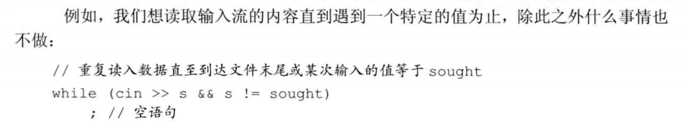

# 第五章 语句

[TOC]

## 1. 简单语句

> ​		C++中语句多数以分号结尾，一个表达式末尾加上分号就变成了 **表达式语句**

- **空语句**：

  - 最简单的语句：**空语句**，空语句只含有一个单独的分号；

  ```c++
  ;	//空语句
  ```

  - **使用场景**：语法上需要，但是逻辑上不需要

- **别漏写分号，也别多写分号**

- **复合语句**（块）：复合语句是指花括号括起来的语句和声明的序列，复合语句也被称为 **块**，一个 **块** 也就是一个作用域

  - **使用场景**：程序从逻辑上要执行多条语句，但是语法上只能一条

  

  - 空快的作用等价于空语句

------


## 2. 语句作用域

- 可以在 **if**、**Switch**、**while**、**for**语句的控制结构内定义变量。定义在控制结构当中的变量只在相应语句的内部可见，一旦语句结束，变量也就超出其作用范围网了


------


## 3. 条件语句

> ​		c++语言提供了两种条件执行语句，
>
> 		1. if 语句
> 		1. Switch语句


### 3.1 if 语句

- **作用**：判断一个指定的条件是否为真，为真则执行另外一条语句

- **语法形式**：

  ```C++
  if (condition)
  	statement
  ```

- **if-else语句形式**：

  ```C++
  if （condition）
      statement1
  else
      statement2
  ```

- **嵌套if语句**：

  ```C++
  if （condition1）
      statement1
  else{
      if （condition2）
          statement2
      else
          statement3
  }
  ```

- **else后面如果要跟多个语句，需要花括号变成语句块**

- **使用花括号控制执行路径**

- **悬垂else**：else只与离他最近的if匹配，不会因为缩进影响

------


### 3.2 Switch语句

- **作用**：**Switch语句** 提供 了一条便利的途径使得我们能够在若干固定选项中做出选择

- **语法形式**：

  ```C++
  switch (选项表达式){
      case 选项一:
          statement;
      case 选项二:
          statement;
  }
  ```

- **case关键字和他对应的值** 一起被称为 **case标签**，case标签必须是整型常量表达式

#### （1）switch内部控制流

> ​		如果某个case标签匹配成功，将从该标签开始往后顺序执行所有 case分支，除非程序显式地中断了这一过程，否则直到switch的结尾处才会停下来。要想避免执行后续case分支的代码，我们必须显式地告诉编译器终止执行过程。

> ​		也有一些时候默认的switch行为才是程序真正需要的。每个case标签只能对应一个值，但是有时候我们希望两个或更多个值共享同一组操作。此时，我们就故意省略掉break语句，使得程序能够连续执行若干个case标签。


#### （2）漏写break容易引发缺陷

> ​		如果程序只匹配一个case分支的语句，记得加上break


#### （3）default标签

> ​		如果 **没有一个case标签** 能匹配上Switch表达式的值，程序将执行 **default标签的语句**


#### （4）Switch内部的变量定义

 

------


## 4. 迭代语句

> ​		迭代语句通常称为循环，直到他满足某个条件才停下来


### 4.1 while语句


### 4.2 传统的 for 语句


### 4.3 范围 for 语句


### 4.4  do while 语句


## 5. 跳转语句

> ​		跳转语句中断当前的执行过程。c++提供了4种跳转语句：break、continue、goto、return


### 5.1 break 语句


### 5.2 continue 语句


### 5.3 goto 语句


### 5.4 return语句在第六章第三节介绍

------


## 6. try 语句块和异常处理


### 6.1 throw 表达式


### 6.2 try语句块


### 6.3 标准异常