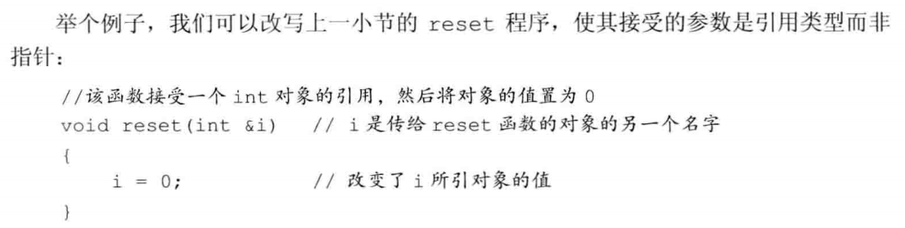
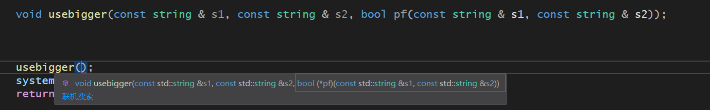

# 第六章 函数

[TOC]

**函数** 是一个 **命名了的代码块**，我们通过调用函数执行相应的代码。

**函数** 可以有 **0个** 或者 **多个参数**，而且通常会产生一个结果。

可以 **重载** 函数：就是说，同一个名字可以对应几个不同的函数

## 1. 函数基础

> ​		一个典型的函数定义包括以下的四个部分：
>
> 1. 返回类型
>
> 2. 函数名字
>
> 3. 由0个或者多个形参组成的列表：形参以逗号隔开，形参的列表唯一一对圆括号之内
>
> 4. 函数体：函数执行的操作在语句块中说明，该语句块称为 **函数体**
>
>    
>
>    函数需要通过 **调用运算符** 来执行函数，调用运算符的形式是 **一对圆括号**
>
>    调用运算符作用于一个 **表达式**（该表达式是函数或者指向函数的指针）
>
>    圆括号之内是一个用逗号隔开的 **实参列表** ，函数调用的时候用 **实参初始化形参**
>
>    **调用表达式的类型** 就是 **函数的返回类型**
>
>    
>
> 内容如下：
>
> - **编写函数**
> - **调用函数**
> - **形参和实参**
> - **函数的形参列表**
> - **函数的返回类型**


- **编写函数**

  ```C++
  // 该函数作用是求阶乘
  int fact(int val) {	// 这部分为  返回类型 + 函数名 + 形参列表
  	int ret = 1;
  	while (val>1)
  	{
  		ret *= val--;	// 先乘原来的数，然后再减1
  	}
  	return ret;		// 返回值的类型必须与函数定义时的返回类型一致
  }	// 花括号括起来的是函数体
  ```


- **调用函数**：上面程序要调用fact函数必须提供一个整型的值，调用得到的结果也是一个整型的值

  **调用函数** 主要完成两项工作：

  - 用实参初始化函数对应的形参
  - 将控制权转移给被调用函数，这个时候主函数被暂时中断，被调函数开始执行

  **return 语句** 也完成了两项工作：

  - 返回return语句中的值
  - 将控制权从被调函数转移回主调函数


- **形参和实参**

  - **实参** 是 **形参** 的初始值。第一个实参初始化第一个形参，依次类推

  - **实参的类型** 必须与 **对应的形参类型** 相 **匹配**，即能够发生类型转换的类型

  - **实参的数量** 与 **形参数量** 一致

    ```C++
    fact("hello");	// 类型不对
    fact();			// 实参数量不足
    fact(42,30,12);	// 实参过多			
    ```

    

- **函数的形参列表**

  - 函数的形参列表可以为空，但是不能省略。

    - 可以书写一个空的形参列表
    - 也可以用关键字 void 表示

    ```C++
    void f1()		// 隐式定义空列表参数
    void f2(void)	// 显式的定义空形参列表
    ```

  - 形参列表中符形参通常用逗号隔开，每个形参都是含有一个声明符的声明，即使两个形参的类型都一样，也要把两个类型都写出来

    ```C++
    int f3(int v1,v2)	// 错误，每个形参都要声明符标识出类型
    int f4(int v1,int v2)	// 正确
    ```

    

- **函数的返回类型**

  - 返回类型如果是 **void**，表示函数不返回任何值
  - 函数的返回类型不能是：
    - **数组类型**，但是返回类型可以是 **指向数组的指针**
    - **函数类型**，但是返回类型可以是 **指向函数的指针**

------


### 1.1 局部对象

> ​		C++语言中，名字有 **作用域**，对象有 **生命周期**
>
> - 名字的作用域是 **程序文本的一部分，名字在其中可见**
> - 对象的生命周期是 **程序执行过程中该对象存在的一段时间**
>
> 内容如下：
>
> - 自动对象
> - 局部静态对象

- **自动对象**：在函数中定义，生命周期在函数体内的对象
  - 对于普通局部变量，当函数控制路径经过变量定义语句时创建该对象，到达语句块末尾的时候销毁它。这样的只存在于块执行期间的对象称为 **自动对象**


​	

- **局部静态对象**：在函数中定义，生命周期伴随整个程序执行过程的对象
  - 某些时候，有必要令局部变量的生命周期贯穿函数调用及之后的时间。可以将局部变量定义成static类型从而获得这样的对象。局部静态对象（local static object）在程序的执行路径第一次经过对象定义语句时初始化，并且直到程序终止才被销毁，在此期间即使对象所在的函数结束执行也不会对它有影响。


------


### 1.2 函数声明

> ​		函数的名字**必须在使用之前声明**，函数**只能定义一次，但是可以声明多次**
>
> ​		**函数的声明无须函数体，但是函数的定义要函数体**
>
> ​		因为函数的声明不包含函数体，所以不需要形参，但是写上形参名字有好处，能够帮助使用者更好的理解函数的功能
>
> ​		**函数的三要素**：返回类型、函数名、形参类型描述了函数的接口
>
> 内容如下：
>
> - 在头文件中进行函数声明

- 在头文件中进行函数声明
  - 之前建议变量在头文件中声明，在源文件中定义。与之类似，函数也应该在头文件中声明，在源文件中定义


------


### 1.3 分离式编译

> ​		随着程序越来越复杂，我们希望把程序的各个部分分别存储在不同文件中。
>
> ​		把使用这些函数的代码存在其他源文件中。为了允许编写程序时按照逻辑关系将其划分开来，C++语言支持所谓的分离式编译（separate compilation）。分离式编译允许我们把程序分割到几个文件中去，每个文件独立编译
>
> 内容如下：
>
> - 编译和链接多个源文件

- **编译和链接多个源文件**
  - 假设fact函数的定义位于一个名为fact.cc的文件中，声明位于Chapter6.h头文件，另外，我们在名为factMain.cc的文件中创建main函数，main函数将调用fact函数。
  - 要生成可执行文件，必须告诉编译器我们用到的代码在哪里


### 1.4 练习题

#### （1）实参和形参的区别是什么？

​		答：实参是函数调用的实际值，是形参的初始值，形参是函数的接收实参后进行操作的容器。

#### （2）指出下面函数的错误


#### （3）编写你自己的fact函数，检查是否正确


#### （4） 编写一个与用户交互的函数，要求输入一个数字，计算生成该数字的阶乘。在main函数中调用该函数

```c++
int jiecheng(int num) {
	int i = 1;
	while (num>1)
	{
		i *= num--;
	}
	return i;
}

int main() {

	cout << "请输入需要求阶乘的数" << endl;
	int num;
	cin >> num;
	int a = jiecheng(num);
	cout << a << endl;
	system("pause");
	return 0;
}
```


#### （5）编写一个函数输出其实参的绝对值

```C++
int jueduizhi(int num) {
	int a;
	if (num < 0) {
		a = -num;
	}
	else {
		a = num;
	}
	return a;
}

int main() {

	int num;
	cout << "请输入需要求绝对值的值" << endl;
	cin >> num;
	int a = jueduizhi(num);
	cout << a << endl;
	system("pause");
	return 0;
}
```


#### （6）说明形参、局部变量以及局部静态变量的区别。编写一个函数，同时用到这三种形式

```C++
int hhh(int num) {	// int num 为形参
	int a = 2;	// 局部变量
	static int b = 1;	// b是局部静态变量，函数结束值还存在
	for (int i = 0; i < a; ++i) {	// 计算平方
		b = num * b;	
	}
	return b;
}

int main() {

	int num;
	int a = 0;
	cout << "请输入值" << endl;
	cin >> num;
	while (a<2)		// 计算平方后，使用计算结果再次平方
	{
		cout << hhh(num) << endl;
		a += 1;
	}
	system("pause");
	return 0;
}
```


#### （7）编写一个函数，当它第一次被调用时返回0，以后每次被调用返回值加1

```C++
int returnplusone() {
	static int a = 0;
	return a++;
}

int main() {

	int a = 0;
	while (a<10)
	{
		cout << returnplusone() << endl;
		a++;
	}
	system("pause");
	return 0;
}
```


#### （8）编写一个名为hello.h的头文件，令其包含fact（）函数求阶乘

#### （9）编写自己的fact.cpp,factmain.cpp，包含hello.h头文件，通过这些文件理解编译器支持分离式编译


------


## 2. 参数传递

> ​		每次调用函数都会重新创建它的形参，并用传入的实参进行初始化
>
> ​		**形参的类型** 决定了 **形参和实参的交互方式**
>
> - 如果 **形参是引用类型**，他将绑定到对应的实参上，否则将实参的值拷贝后赋给形参
>
> 内容如下：
>
> - 引用传递
> - 值传递

- **值传递**：当实参的值被拷贝给形参时，形参和实参是两个相互独立的对象，我们说这样的实参被 **值传递**。或者 **函数被传值调用**
- **引用传递**：当形参为引用类型，则说它对应的实参 **被引用传递** 或者 **函数被传引用调用**，和其他引用一样，引用形参也是它绑定的对象的别名。也就是说，引用形参是它对应的实参的别名

------


### 2.1 传值参数 （拷贝传递）

> ​		当初始化一个非引用类型的变量时，初始值被拷贝给变量，此时，对变量的改动不会影响初始值
>


- **指针形参：** 

  - **指针的行为** 和 **其他非引用类型一样**，当执行指针拷贝操作时，拷贝的是指针的值。拷贝之后两个指针是不同的指针。因为指针我们可以间接的访问它所指的对象。所以通过指针可以修改它所指对象的值

  

------


### 2.2 传引用参数 （传递别名，可以改动原对象）

> ​		引用的操作实际上是作用在引用所引的对象上
>




- **使用引用避免拷贝**
  - 拷贝大的类类型对象或者容器对象比较低效，甚至有的类类型（包括I0类型在内）根本就不支持拷贝操作。当某种类型不支持拷贝操作时，函数只能通过引用形参访问该类型的对象。

- **使用引用形参返回额外信息**
  - 一个函数只能返回一个值，然而有时函数需要同时返回多个值，引用形参为我们一次返回多个结果提供了有效的途径。


```C++
size_t character_occur_times(const string &s,char c,size_t &occurs) {	// 形参：1.字符串的常量引用，表示不允许通过引用修改字符串 2.搜索的字符 3.出现的次数
	
	auto size = s.size();	// 获取字符串长度，用来循环查找，同时当做flag，当第一次出现时用其存储
	occurs = 0;				// 初始化出现次数
	for (decltype(size) i = 0; i < s.size(); ++i) {
		if (s[i] == c) {
			if (size == s.size()) {		// 如果是第一次出现，则把位置存储到size变量中
				size = i+1;
			}
			++occurs;
		}
	}
	return size;	// 返回第一次出现的地方
}
```


------


### 2.3 const形参和实参

> ​		当形参是 **const** 时，**顶层const** 作用于 **对象本身**
>
> ​		但是 **实参初始化形参** 时会 **忽略掉** 顶层const，也就是说形参的顶层const被忽略了，所以实参传递的对象可以是 **常量对象**，也可以是 **非常量对象**
>
> 内容如下：
>
> - 指针或引用形参与const
> - 尽量使用常量引用

**这个其实就相当于 顶层const 修饰的对象能被哪些初始化，函数形参初始化，与常规初始化没有区别**


```C++
int f(const int num) {	// 累加

	num = 10;		// 不可以在函数体内部修改形参的值
	int sum = 0;
	for (int i = 0; i < num; ++i) {
		sum += i;
	}
	return sum;
}

int main() {

	int num = 9;
	const int num_1 = 10;
	int sum;
	sum = f(num);		// 可以使用非常量对象作为实参
	sum = f(num_1);		// 可以使用常量对象作为实参
	system("pause");
	return 0;
}
```


- **指针或引用形参与const**
  - 指针或引用形参初始化，一般是底层初始化，即 **修饰的是指向的对象**
  - 形参的初始化方式与变量的初始化方式是一样的

****

**同样的初始化规则可以应用到参数传递上**


- **尽量使用常量引用**
  - 如果不将形参定义成常量引用，函数可能修改其传入实参的值，从而导致不必要的麻烦
  - 使用非常量引用，也会极大的限制函数所能接受的实参类型，比如，**不能接受const对象、字面值或者需要类型转换的对象**


------


### 2.4 数组形参

> ​		数组有两个性质，使得我们在函数中操作数组时有影响：
>
> 1. 不允许拷贝数组；
>
> 2. 使用数组时通常会将其转换成指针
>
>    所以，因为不能拷贝数组，所以我们无法使用值传递传递参数，传递数组，本质上传递的是指向数组首元素的指针
>
> 内容如下：
>
> - **数组形参形式**：介绍数组元素作为实参时，形参的形式
> - **对数组的操作**（指针）：必须知道数组的长度，三个方法
>   - **使用标记指定数组长度**：对特殊的没有差别的数据无效
>   - **标准库规范**：传递头指针和尾后指针来确定长度
>   - **额外传递一个形参表示数组长度**：多传递一个形参，表示数组的长度
>   - **数组形参和const**：只有在对不许要对数组进行写操作的时候，使用指向const的指针
> - **对数组的操作**（引用）：
>   - **数组引用形参**：形参也可以是数组的引用


- **数组形参形式：**

**如果我们传给print函数的是一个数组，则实参自动地转换成指向数组首元素的指针，数组的大小对函数的调用没有影响。**


- **使用标记指定数组长度**


- **使用标准库规范**
  - 管理数组实参的第二种技术是 **传递指向数组首元素和尾后元素的指针** ，使用该方法我们可以这样输出元素内容


- **显式传递一个表示数组大小的形参**


- **数组引用形参**


- **传递多维数组**

  - **C++语言实际上没有真正的多维数组**，所谓的多维数组其实是 **数组的数组**

    

------


### 2.5 main：处理命令行选项

> ​		**有时候我们需要给 main 传递实参**，一种常见的情况是用户通过一组选项来确定函数所要执行的操作

**示例：** 假定main函数位于可执行文件 prog 之内，我们可以向程序传递下面的选项：

```shell
prog -d -o ofile data0
```

这些命令行选项通过两个（可选的）形参传递给main函数：

```C++
int main(int argc，char *argv[] ){……}
```

- 第二个形参 **argv** 是一个数组，其中的元素是指向字符串的 **指针**，表示存放指针的数组
- 第一个形参 **argc** 表示数组中字符串的数量

因为第二个形参是数组，所以main函数也可以定义成：	

```C++
int main(int argc, char **argv){……}		// 指针的指针表示argv是指向（字符串型指针（代表一个字符串））的指针
```


#### （1）实参传递给main函数流程

- 当实参传给main函数之后，argv第一个元素指向程序的名字或者一个空字符串
- 接下来的元素才一次传递命令行提供的实参


------


### 2.6 含有可变形参的函数

> ​		有时候，我们无法预知应该向函数传递几个实参。
>
> ​		那么为了编写能够处理不同数量实参的函数，C++11提供了两种主要的方法：
>
> - 当所有的实参类型相同，可以 **传递一个名为initializer_list的标准库类型**
> - 如果实参 类型不同，可以编写一种特殊的函数，也就是所谓的可变参数模板《第16章讲》


- **initializer_list形参**

  - initializer_list 是一种标准库类型，用于表示某种特定类型的值的数组。initializer_list类型定义在同名的头文件中

  - **initializer_list  中类型必须一致**
  - **initializer_list  中元素不可更改，全是const类型**
  - **initializer_list 传递形参格式：**
  - **给initializer_list 形参传递实参格式：**必须要加花括号


- **省略符形参**

------


## 3. 返回类型和return语句

> ​		return 语句将终止当前正在执行的函数，并将控制权返回到调用该函数的地方
>
> ​		return的形式有两种：
>
> 1. return；
> 2. return expr；


### 3.1 无返回值函数

- 没有返回值的return语句只能在返回类型是void的函数中。返回void的函数不要求非得有return语句，因为在这类函数的最后一句会隐式的执行 return
- 通常情况下，如果void函数想在它的中间位置退出可以使用return语句
- void函数也可以使用第二种表达方式，但是expr必须也是void函数，不然返回其他类型会报错

------


### 3.2 有返回值类型

- return语句的第二种形式提供了函数的结果，只要函数的返回类型不是void，则该函数内的每条return语句都必须返回一个值
- return返回值的类型必须与函数的返回类型相同，或者能够类型转换

#### （1）值是如何被返回的？

> ​		返回一个值的方式和初始化一个变量或者形参的方式完全一样：返回的值用于初始化调用点的一个临时量，该临时量就是函数调用的结果

- 返回局部变量时，其实就是一个临时量
- 返回形参中引用类型时，返回的是对象的引用，而不是其对象的拷贝


#### （2）不要返回局部对象的引用或者指针 

- 函数完成后，它所占的存储空间也会随之释放，因此函数终止意味着局部变量的引用将指向不再有效的内存区域


#### （3）返回类类型的函数和调用运算符


#### （4）引用返回左值

- 函数的返回类型决定函数调用是否能够得到左值
- 调用一个返回引用的函数得到左值，其他返回类型都是右值


#### （5）列表初始化返回值 

- C++11新标准规定，函数可以返回花括号包围的值的列表
- 对于内置类型：花括号只能包含一个值
- 对于类类型：由类本身定义初始值如何使用


#### （6）主函数main的返回值

- main函数允许没有return语句直接结束，因为如果没有return语句，编译器会隐式的插入一条返回0的return语句
- 返回0表示执行成功，其他值返回失败


#### （7）递归

> ​		如果一个函数调用了它自身，不管这种调用是直接还是间接的，都称该函数是递归函数

------


### 3.3 返回数组指针

> ​		因为数组不能被拷贝，所以函数不能返回数组，不过，函数可以返回数组的指针或者引用
>
> ​		语法上，定义一个返回数组的指针或引用的函数比较繁琐，但是有些方法可以简化这一任务
>
> 最直接的方法：使用类型别名
>
> ​		


#### （1）声明一个返回数组指针的函数

- **如果想声明函数时不使用类型别名，需要记住被定义的名字后面数组的维度**


- 


- **和声明一样，定义一个返回数组指针的函数，数组的维度必须跟在函数名字之后，并且函数形参列表也跟在函数名字后面且形参列表应该先于数组的维度**。所以返回数组指针的函数形式如下：

```C++
type (*function(参数))[维度]
```


- 


- **逐层理解该声明的含义**：

- 


#### （2）使用尾置返回类型

> ​		C++11标准中海油一种可以简化上述func声明的方法，就是使用尾置返回类型。任何函数定义都可以使用尾置 返回，但是对于返回情况比较复杂的最有效
>

- **使用形式**：


#### （3）使用decltype

> ​		还有一种情况，如果我们知道函数返回的指针指向哪个数组，就可以使用decltype关键字来声明返回类型
>


------


## 4. 函数重载

> ​		如果在同一个作用域内的几个函数名字相同但是形参列表不同，我们称之为 **重载函数**

例如：**定义了几个 print 函数**

```C++
void print(const char *cp);
void print(const int *beg,const int *end);
void print(const int a[],size_t size);			// 相当于print函数有三个重载

int a[3] = {1,2,3};
print("hello");		// 调用第一个重载
print(begin(a),end(a));	// 调用第二个重载
print(a,end(a)-begin(a));	// 调用第三个重载 ，因为数组时内置类型，没有成员函数size这些
```


### 4.1 定义重载函数


------


### 4.2 判断两个形参是否相异

- 有时候两个形参列表看起来不一样，但实际上是相同的。形参的名字仅仅起到帮助记忆的作用，有没有它都并不影响形参列表的内容


- 第二对声明看起来类型不同，但是其实是同一个类型


------


### 4.3 重载与const形参

- 顶层const不影响传入函数的对象，**一个顶层const的形参和另一个更没有顶层const的形参无法区分开**


- **底层const可以实现重载**


因为，实参是常量的话，无法传递参数给第一个重载，只能作用于底层const的重载

------


### 4.4 const_cast和重载

- const_cast是强制类型转换，能将底层const修饰的常量对象转换成非常量对象。
- 

------


### 4.5 调用重载的函数

调用重载函数的三种可能的结果：

- 编译器找到一个与实参最佳匹配的函数，并生成调用该函数的代码
- 找不到任何一个函数与调用的实参匹配，这时，编译器发出 **无匹配**的错误信息
- 有多于一个函数可以匹配，但是每一个都不是明显的最佳选择，此时也将发生错误，称为二义性调用

------


### 4.6 重载与作用域

- **如果在内层作用域声明名字，将隐藏外层作用域中声明的同名实体**
- **在不同的作用域中无法重载函数名**


------


## 5. 特殊用途语言特性

三种函数相关的语言特性

- 默认实参
- 内联函数
- constexpr函数

### 5.1 默认实参

> ​		默认实参，就是形参默认给定一个值，给形参默认初始化，如果传入实参，则用实参再显式初始化，如果没有传入实参，则就默认给定值初始化


- 使用默认实参：


------


### 5.2 内联函数和constexpr函数


#### （1）内联函数

- **将这些函数指定成内联函数可以避免函数调用的开销**
  - 内联函数为什么可以避免调用函数调用开销

​		这样能够消除函数允许时的开销

- **怎么将其变成内联函数**：	

#### （2）constexpr函数

> ​		**constexpr函数** 是指 能够用于常量表达式的函数

- 定义constexpr函数的方法与其他函数类似，
  - 函数的**返回类型**和**所有形参**都得是**字面值类型**
  - 函数体中必须**有且只有一条** return语句


#### （3）内联函数和constexpr函数一般都放在头文件中

------


### 5.3 调试帮助


## 6. 函数匹配

## 7. 函数指针

> ​		函数指针指向的是函数而非对象，和其他指针一样，函数指针指向某种特定的类型
>

- **函数的类型** 由**它的返回类型**和 **形参类型** 共同决定，与函数名无关


- **声明一个指向函数的指针** 只需要用 **指针替换函数名** 就行了


### 7.1 使用函数指针

- **当我们把函数名作为一个值使用的时候，该函数将会自动转换成指针**


- **我们还可以使用执行那个函数的指针来调用该函数**


- **指向不同函数类型**（其实就是返回类型加上形参类型，如果这两个一样，就说函数类型是一样的）不存在转换规则，我们可以为函数指针赋予一个nullptr或者值为0的整型字面值常量表达式，表示该指针没有指向任何一个函数


#### （1）重载函数指针

> ​		当我们使用重载函数时，上下文必须清晰的界定到底应该选用那个函数


#### （2）函数指针形参 

> ​		和数组类似，虽然不能定义**函数类型的形参**，但是**形参**可以是 **指向函数的指针**

- 形参定义**为指向函数的指针**，如果形参是函数类型，那么编译器会自动将其转换成指向函数的指针类型



上面这句声明等价于：


- 


- **在实参中**，直接将函数作为实参用，会自动转换成指针


- 


- **使用类型别名和decltype简化使用函数指针的代码**
  - func和func2都是函数类型，**图中的两个表达式等价的**
  - func3和func4都是指向函数的指针，图中的两个表达式是等价的


#### （3）返回指向函数的指针

- 虽然不能返回一个函数，但是能够返回指向函数类型的指针，我们需要把返回类型写成指针形式，因为编译器不会自动的将函数的返回类型当成对应的指针类型处理


- 


- **返回类型不会自动的转换成指针，我们需要显式的将返回类型指定为指针**


当然我们也可以直接按照下面的形式声明 **f1**


- 


- **出去完整型考虑，还可以使用尾置返回类型的方式声明一个返回函数指针的函数**


#### （4）将auto和decltype用于函数指针类型

- **如果我们呢知道返回的函数是哪个，我们可以直接使用decltype简化书写函数指针返回类型的过程**


- **如果不知道返回函数，可以根据表达式右边的类型使用auto推断出类型来简化书写函数指针返回类型的过程**


