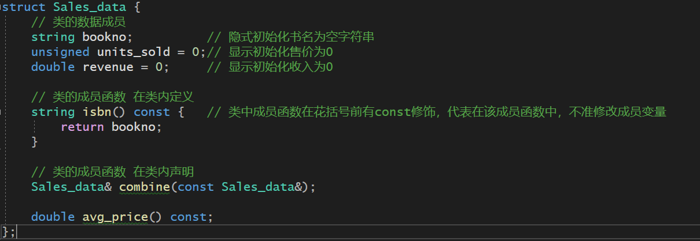
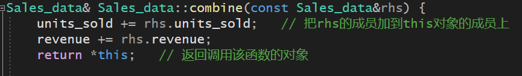

# 第七章 类

[TOC]

> ​		类的基本思想是 **数据抽象** 和 **封装**
>
> ​		**数据抽象**：是一种依赖于 **接口** 和 **实现** 分离的编程技术
>
> - 类的接口包括：用户能够执行的操作
>
> - 类的实现包括：类的数据成员、负责接口实现的函数体以及定义类所需的各种私有函数
>
>   **封装**：实现了 **类的接口** 和 **类的实现** 的分离。封装后的类隐藏了它的实现细节，也就是说类的用户只能**使用接口而无法访问实现部分**
>
>   **具体使用**：首先定义一个抽象数据类型，**类的设计者**负责考虑类的实现过程；**使用该类的程序员**只需要抽象的思考类型做了什么，无须了解类型的工作细节

## 1. 定义抽象数据类型

> ​		比如在第一章使用的Sales_item类是一个抽象数据类型，我们可以通过它的接口来使用一个Sale_item对象，但是我们不能访问Sale_item对象的数据类型，事实上我们不知道这个类有哪些数据类型


### 1.1 设计Sale_data类

- Sales_data的接口包含：
  - 一个isbn成员函数，用于返回对象的 **ISBN** 编号
  - 一个combine 成员函数，用于将一个Sales_data对象加到另一个对象上
  - 一个名为add的函数，执行两个Sales_data对象的加法
  - 一个read函数，将数据从istream 读入到Sales_data对象中
  - 一个print 函数，将Sales_data对象的值输出到ostream


### 1.2 定义改进的Sales_data类

- **类的数据成员：** **bookno**（书的序号string类型）、**ISBN编号**（书的编号string类型）、**units_sold**（书的售价unsigned 类型）、**revenue**（总销售收入 double类型）
- **类的成员函数：** combine（） 和 isbn（返回书的ISBN编号 string类型）、avg_price（返回平均价格 double类型）

```C++
struct Sales_data {
	// 类的数据成员
	string bookno;			// 隐式初始化书名为空字符串
	unsigned units_sold = 0;// 显示初始化售价为0	
	double revenue = 0;		// 显示初始化收入为0

	// 类的成员函数 在类内定义
	string isbn() const {	// 类中成员函数在花括号前有const修饰，代表在该成员函数中，不准修改成员变量
		return bookno;
	}
	
	// 类的成员函数 在类内声明
	Sales_data& combine(const Sales_data&);

	double avg_price() const;
};

// Sales_data的非成员接口函数
Sales_data add(const Sales_data&, const Sales_data&);
ostream& print(ostream&, const Sales_data&);
istream& read(istream&, Sales_data&);
```




#### （1）定义成员函数

- 类的所有成员都**必须在类的内部声明**，但是成员函数体可以定义在类外，也可以定义在类内（但是在类内必须声明）

  - 对于上面的Sales_data的例子，isbn函数定义在了类内，而combine和avg_price函数定义在了类外，只声明在类内

    - 分析下 isbn 函数，它的参数列表为空，返回值是一个string对象

      ```C++
      string isbn() const {
      		return bookno;
      	}
      ```

      此例中有一条return语句，返回Sales_data对象的bookno数据成员，但是这个函数是怎么获得bookno成员所依赖的对象的呢？

      

#### （2）引入this

- **this 是一个常量指针**，永远的指向调用成员函数的对象（this指针，只能存储调用的对象的地址，并且不能更改指向）

- 成员函数内部使用其他成员，都是通过隐式地使用this访问

  ```c++
  string isbn() const{
      return bookno;
  }
  // 等价于
  string isbn() const{
      return this->bookno;
  }
  ```

  `this - > bookno`， **this 指向调用成员函数的对象的地址**，`->`表示**先解引用，得到该对象，然后调用该对象里面的成员**。这里就是该对象的bookno成员，并将其返回


#### （3）引入const成员 

- isbn 函数的另一个关键之处在于紧随其后的const关键字，这里**const的作用**是**修改隐式 this指针的类型**
  - 默认情况下，this 的类型是指向类类型非常量版本的常量指针，因为成员函数体内不会改变this所指的对象，所以将this 设置成指向常量的指针有助于提高函数的灵活性（即设置成**const Sales_data *const**类型），但是this是隐式的，并且不会出现在形参中，所以底层const得找个地方声明。 c++选择在成员函数的形参列表之后放置const关键字，用来表示this是一个指向常量的指针

```C++
// 隐式的this 相当于下面的this显示的函数定义
string isbn (const Sales_data *const this){return this->isbn;}
```


#### （4）类作用域和成员函数

- **类本身就是一个作用域**。类的成员函数的定义嵌套在类的作用域之内，因此，isbn中用到的名字bookno其实就是定义在Sales_data内的数据成员
- bookno定义在isbn之后，而isbn还能使用bookno，是因为，编译器 ：1.先编译成员的声明，2.然后才轮到成员函数体。因此成员函数体可以随意使用类中的其他成员，无须在意次序


#### （5）在类的外部定义成员函数

-  在类的外部定义成员函数时，**成员函数的定义必须与他的声明匹配**。如果成员被声明成常量成员函数，那么它的定义也必须在参数列表后明确指定const属性
- **类的外部定义成员的名字必须包含它所属的类名**

```C++
double Sales_data::avg_price() const {
	if (units_sold) {
		return revenue / units_sold;
	}
	else {
		return 0;
	}
}
```

这里的revenue 和 units_sold，实际上隐式地使用了Sales_data的成员，this指针被隐藏了


#### （6）定义一个返回this对象的函数

- 因为只有**返回引用的函数能够得到左值**，**其他返回的类型得到的都是右值**
- 函数 combine 返回调用该函数的对象，也就是返回 **`*this`（this是调用该函数对象的指针）**
- 该成员函数，要返回它自己左值（即保证对象一直都存在，且地址不变），而不是返回右值（返回右值等于生成了一个新的对象），所以函数的返回类型为 **引用**

```C++
Sales_data& Sales_data::combine(const Sales_data&rhs) {
	units_sold += rhs.units_sold;	// 把rhs的成员加到this对象的成员上
	revenue += rhs.revenue;
	return *this;	// 返回调用该函数的对象
```



------


### 1.3 定义类相关的非成员函数

> ​		类的作者常常需要定义一些富足函数，比如add、read和print等
>
> ​		尽管这些函数定义的操作从概念上来说属于类的接口的组成部分，但是他们实际上不属于类本身

- 非成员函数声明 和 定义 一般分离开来
  - 非成员函数是类接口的组成部分，则这些函数的声明应该与类在同一个头文件内


#### （1）定义read 和 print 函数 

- **read 函数**：从给定流中将数据读到给定的对象里

```C++
// 获取输入流：输入信息包括ISBN、售出总数和售出价格
istream& read(istream& is, Sales_data& item) {
	double price = 0;	
	is >> item.bookno >> item.units_sold >> price;	// 输入流：输入  isbn编号、 售出的总数 、 单本书价格
	item.revenue = price * item.units_sold;		// 计算总收入
	return is;		// 返回输入流对象	
}
```

- **print函数**：负责将给定对象的内容打印到给定的流中

```C++
// 获取输出流：输出书号、售出总数、总收入、平均收入
ostream& print(ostream& os, const Sales_data& item) {
	os << item.isbn() << " " << item.units_sold << " "
		<< item.revenue << " " << item.avg_price();
	return os;
}
```


## 2. 访问控制与封装

## 3. 类的其他特性

## 4. 类的作用域

## 5. 构造函数再探

## 6. 类的静态成员