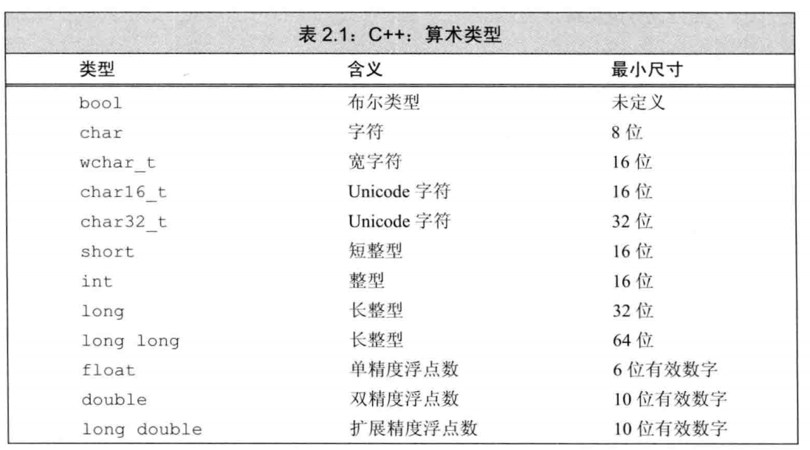
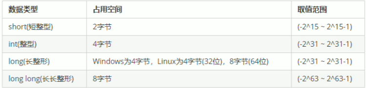
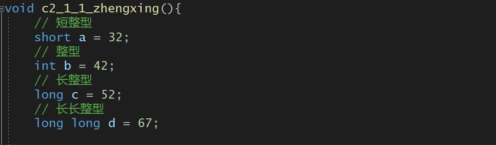
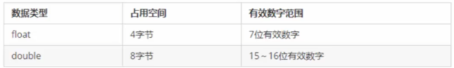
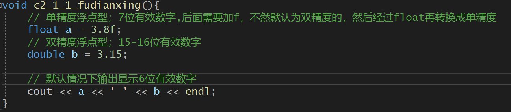
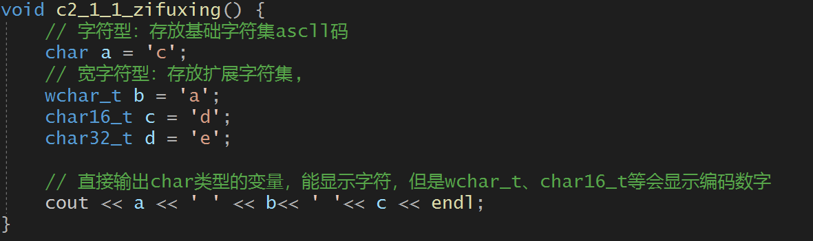
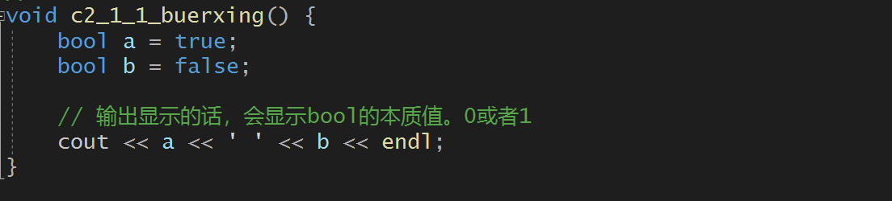
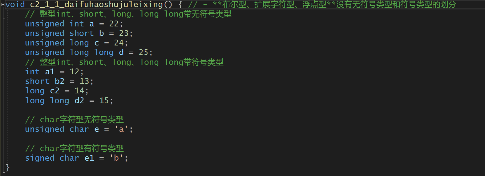
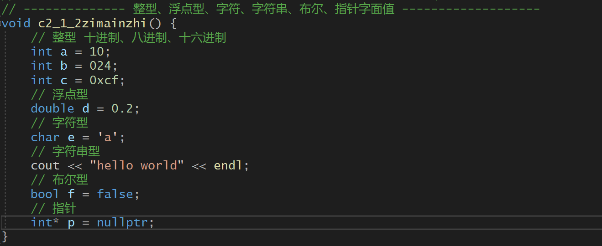

# 第二章 变量与基本数据类型

> 数据类型存在的意义是给变量分配合适的内存空间

[TOC]

## 1. 基本内置类型

- 基本的内置类型主要分为两类：

  - **算术类型：** 整型（包括布尔型、字符型）、浮点型
    - 也就是说布尔型和字符型在底层上是属于整型的。

  - **空类型（void）**

- **sizeof** 关键字计算变量或者类型所占内存大小
- **带符号的数据类型**

### 1.1 算术类型

#### sizeof关键字

- **作用：**利用sizeof关键字可以统计数据类型所占内存大小
- **语法：** `sizeof(数据类型or变量)`

------

#### 1.1.1 整型

- **作用**：整型变量表示的是整数类型的变量

- C++表示整型的类型有以下方式，**区别在于所占内存空间不同：**

> 一个字节byte为8个比特，32位系统一个字为4个字节，64位系统一个字为8个字节

​		**位：** 位是最基本的概念，在计算机中，由于只有逻辑0和逻辑1的存在，因此很多东西、动作、数字都要表示为一串[二进制]的字码,其中每一个逻辑0或者1便是一个位。

​		**字节：**Byte，是由八个位组成的一个单元，也就是8个bit组成1个Byte。在计算机科学中，用于表示ASCII字符，便是运用字节来记录表示字母和一些符号

​		**字：**字（Word）代表计算机处理指令或数据的二进制数位数，是计算机进行数据存储和数据处理的运算的单位。

------

#### 1.1.2  浮点型（实型）

- **作用：**用于表示小数
- C++表示浮点型的类型有以下方式；**区别在于有效数字范围和占用空间不同**

- 默认情况下，直接输出会显示6位有效数字

------

#### 1.1.3  字符型

- **作用**：字符型变量用于显示单个字符。并且输出只能显示单个字符
- **语法**：`char ch = 'a';`

> 注意1：字符型初始化或者赋值时，只能使用单引号，不能使用双引号4
>
> 注意2：单引号内只能有一个字符，不能是字符串（多个字符）。

- 字符型变量不是吧字符本身放到内存中，而是将对应的编码放入存储单元

例如：a的ascll码为97；则将97存入

| 数据类型 | 占用空间     | 含义              |
| -------- | ------------ | ----------------- |
| char     | 一字节，8位  | 存放ascll码       |
| wchar_t  | 二字节，16位 | 存放Unicode码     |
| char16_t | 二字节，16位 | 存放Unicode码     |
| char32_t | 四字节，32位 | 存放扩展Unicode码 |

------

#### 1.1.4  布尔型

- **作用：**布尔数据类型代表真或者假的值
- bool 类型只有两个值：
  - true --- 真（本质为1）
  - false --- 假（本质为0）
- bool类型占一个字节大小

------

#### 1.1.5 带符号的数据类型

- **布尔型、扩展字符型、浮点型**没有无符号类型和符号类型的划分
- 整型 `int` 、`short` 、`long` 、`long long`都是带符号的，在这些类型名前添加 `unsigned` 就可以得到无符号类型
- 字符型只有`char` 分为三种类型，`char`、`signed char` 、`unsigned char` 。类型`char`和类型`signed char` 并不一样。`char` 实际上会表现为上述两种形式中的一种，具体有编译器决定
- 带符号的类型，最高的比特位表示符号。例如：8比特的signed char理论上应该可以表示-127至127区间内的值，大多数现代计算机将实际的表示范围定为-128至127。第一位表示符号，后7位表示大小

------

#### 练习题：

**2.1** 类型 int、long、long long 和 short 的区别是什么？无符号类型和带符号类型的区别是什么？float 和 double的区别是什么？

​		答：C++ 规定 short 和 int 至少16位，long 至少32位，long long 至少64位。 带符号类型能够表示正数、负数和 0 ，而无符号类型只能够表示 0 和正整数。

**2.2** 计算按揭贷款时，对于利率、本金和付款分别应选择何种数据类型？说明你的理由。

​		答：使用`double`。需要进行浮点计算。

------

### 1.2 类型转换

跳转到第四章见 类型转换详细解释

------

### 1.3 字面值常量（可以作为变量初始值的量）

- **字面值定义：** 一个形如42的值被称为**字面值常量**，这样的值一望而知。每个字面值常量都对应一种数据类型，字面值常量的形式和值决定了他的数据类型
- 1.3.1 **字面值分类**：整型字面值、浮点型字面值、字符型字面值、字符串字面值、布尔字面值、指针字面值

- 1.3.2 **指定字面值的类型**
- 1.3.3 **转义字符**

#### 1.3.1  整型、浮点型、字符、字符串、布尔、指针字面值

- **整型字面值**：
  - 字面值可以写为十进制、八进制、十六进制等
  - 默认十进制字面值不会是负数，如果是负数，那个负号并不在字面值之内
- **浮点型字面值**：
  - 带小数点的数
- **字符字面值**：
  - 单引号括起来的字符
- **字符串字面值**：
  - 双引号括起来的字符
- **布尔字面值**：
  - true 或 false
- **指针字面值**：
  - nullptr 空

------

#### 1.3.2 指定字面值的类型

通过为字面值添加**前缀和后缀**，可以改变**整型、浮点型、字符型**的字面值默认类型

​																	**字符和字符串字面值**

| 前缀 | 含义                      | 类型     |
| ---- | ------------------------- | -------- |
| u    | Unicode 16字符            | char16_t |
| U    | Unicode 32字符            | char32_t |
| L    | 宽字符                    | wchar_t  |
| u8   | UTF-8(仅用于字符串字面值) | char     |

​																		

​																	**整型字面值**

| 后缀     | 最小匹配类型 |
| -------- | ------------ |
| u or U   | unsigned     |
| l or  L  | long         |
| ll or LL | long long    |

​																	   

​																 	**浮点型**

| 后缀   | 类型        |
| ------ | ----------- |
| f or F | float       |
| l or L | long double |

------

#### 1.3.3 转义字符

​		**两类程序员不能直接使用的字符**：

- **不可打印字符**：退格和其他控制字符
- **特殊含义字符**：单引号，双引号等

​		**这种情况下就需要用到转义字符**

C++规定的转义字符有：

还可以泛化转义字符：因为字符都是ascll码编码，可以用`\` 加字符对应ascll码十进制、八进制、十六进制数来表示转义字符

------

## 2. 变量

- **变量的定义**：变量提供一个具名的，可供程序操作的存储空间。 “变量（variable）”和“对象（object）”可以互换使用。
- 2.1 **定义变量** 
- 2.2 **初始化变量**：初始化与赋值的区别
- 2.3 **变量声明与定义区别**
- 2.4 **标识符**（变量的名字）
- 2.5 **名字的作用域**

### 2.1 定义变量

定义变量：

​	**类型说明符（类型的名字）** +  **变量的名字（标识符）（可以是一个，可以多个变量名组成的列表）**

------

### 2.2 初始化变量

**初始化定义**：当对象在创建时获得了一个特定的值，我们说这个对象被初始化（initialized）了

- 用于初始化变量的值可以是任意复杂的表达式
- 可以使用列表对于一个变量进行初始化（不能对多个变量初始化）
- **默认初始化**：定义变量时没有指定初值，会默认初始化。但是函数体内部内置类型的变量将不被初始化，所以它的值是未定义的，使用这个变量的话，会导致程序出问题

> 初始化与赋值的区别：
>
> ​		答：初始化不是赋值，初始化的含义是创建变量时赋予其一个初始值，而赋值的含义是把对象的当前值擦除，而以一个新值来替代。

------

### 2.3 变量声明与定义的区别

**声明**：声明（declaration）使得名字为程序所知，一个文件如果想使用别处定义的名字则必须包含对那个名字的声明。此时的`i`为声明符

**定义**：定义definition）负责创建与名字关联的实体

> 变量可以被声明多次，但是只能被定义一次

------

### 2.4 标识符（变量的名字）

​		c++标识符只能由**字母、下划线、数字**组成，其中只能以**字母和下划线**开头

- **变量名命名规范**

  

- **C++关键字**：

------

### 2.5 名字的作用域

- **全局作用域**：定义于函数体之外的名字拥有全局作用域；比如main函数的 main
- **块作用域**：定义于函数体之内，出了函数体，就无法访问到该名字
- **嵌套作用域**：
  - 内层作用域：被包含的作用域称为内层作用域
  - 外层作用域：包含着别的作用域的作用域称为外层作用域
  - 外层作用域声明的名字，其所有内层作用域都能访问该名字
- 域作用符 `：：` ：`：：`左边为命名空间，右边为该命名空间作用域的变量名
  - ：：左边为空，则认为是从全局变量中寻找名字

------

## 3. 复合类型

本章主要介绍C++两种重要的复合类型：

- 3.1 **引用**
- 3.2 **指针**
- 声明语句的语法：
  - `数据类型`   `声明符`  `<= 初始值>`
  - 声明符 不等于变量名； 
    - `&a` 可以做声明符，但是变量名为 a
    - `*a` 也可以做声明符，但是变量名为a

### 3.1 引用

> c++11引入了”右值引用“，当我们直接使用术语引用的时候，指的是“左值引用”

- **定义：** 引用（reference）为对象起了另外一个名字，引用类型引用（refers to）另外一种类型。
  - 通过将声明符写成`&d`的形式来定义引用类型，其中`d`是声明的变量名

- **引用本质上是之前变量名的别名**
- **引用必须初始化：** 定义引用时，程序会把**引用和他的初始值绑定**，而不是将初始值拷贝给引用。一旦初始化完成，引用将和它的初始值对象一直绑定在一起。因为**无法令引用重新绑定到另外一个对象**，因此引用**必须初始化**
- **定义引用：**
  - 允许一条语句中定义多个引用，每个引用标识符（变量名）都**必须要以&**开头
  - 引用定义时**只能绑定**在有**内存空间的对象或者变量**上
- **引用并不是一个对象**
- **引用的类型都要与与之绑定的对象类型严格匹配**

------

### 3.2 指针

- **定义：** 指针是指向另外一种类型的复合类型，指针实现了对其他对象的间接访问，指针存储着其他对象的内存地址
- **获取对象地址**：对对象使用**取地址符**获得**对象地址**，取地址符为 `&`
- **指针的类型也要与指向的对象类型严格匹配**
- **指针是一个对象**
- **指针访问指向的对象，使用解引用符 `*`  来访问指向的对象**
- **指针可以不必须初始化**，但是未经初始化指针被使用，会导致很严重问题

指针有如下四个状态:

1. 指向一个对象
2. 指向紧邻对象所占空间的下一个位置
3. 空指针，意味着指针没有指向任何对象
4. 无效指针，也就是上述情况之外的其他值。

------

### 3.3 指向指针的指针

指针的指针的声明符为  `**  + 变量名`

### 3.4 指向指针的引用

​		引用本身不是一个对象，所以，没有指向引用的指针，只有指向指针的引用。

> 小技巧：如何知道一个 **变量的本质**？
>
> ​		看那个符号与 **变量名** 靠的最近。
>
> ​		int **a, *与a靠的最近，这个本质是一个指针，整型指针的指针
>
> ​		int *&a, &与a靠的最近，这个a本质是一个引用，前面的所有为修饰符：表示为**整型指针**，整个就是整型指针的引用

